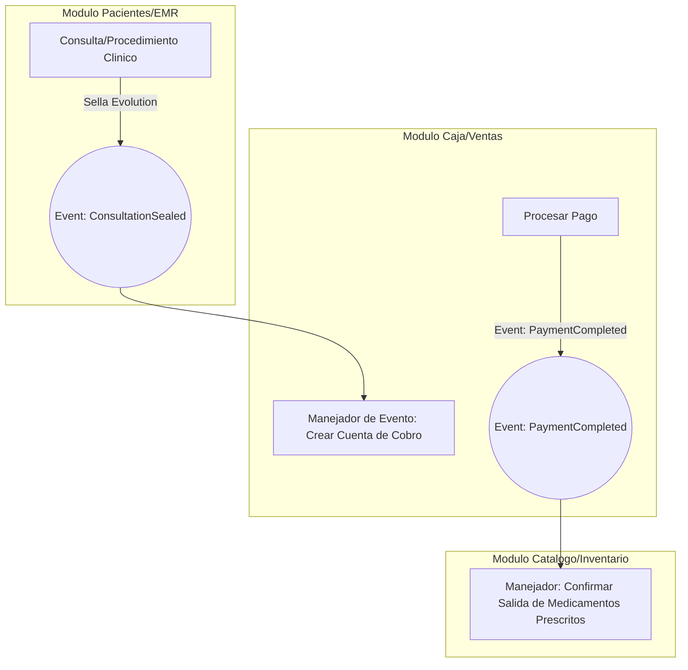
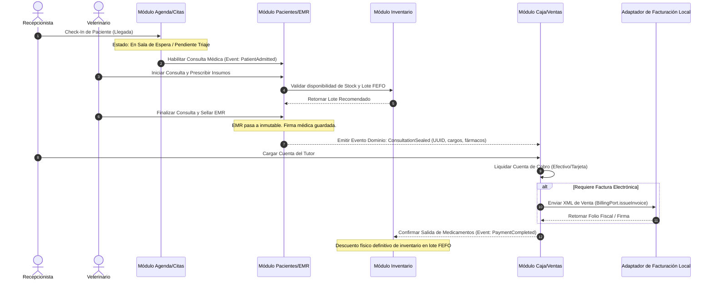

# ESPECIFICACIÓN DE ARQUITECTURA DE SOFTWARE: VetFlow SaaS
**Versión:** 1.0.0  
**Fecha de Publicación:** 16 de Julio de 2026  
**Autor:** CTO Architecture Master (CTO Architect & Architecture Master)  
**Estado:** Propuesta de Diseño Técnico (Para Aprobación de Negocio e Ingeniería)

---

## 1. INTRODUCCIÓN Y OBJETIVOS DE LA ARQUITECTURA

**VetFlow SaaS** es una plataforma en la nube diseñada para gestionar de forma integral clínicas veterinarias en Latinoamérica (LATAM). Su propósito es centralizar la gestión de pacientes (EMR), agendamiento de citas, control de inventario de medicamentos de uso controlado y la facturación localizada en cada país bajo un modelo multi-tenant robusto y escalable.

### Objetivos Arquitectónicos
*   **Aislamiento y Seguridad Multitenant:** Garantizar que los datos entre clínicas estén lógica e infranqueablemente separados a nivel de base de datos.
*   **Desacoplamiento Modular (Modular Monolith):** Estructurar el núcleo de la aplicación en módulos lógicos con límites claros y contratos explícitos para evitar un monolito "espagueti", facilitando una futura migración a microservicios *solo si el negocio lo demanda*.
*   **Arquitectura Limpia (Clean Architecture):** Aislar la lógica de negocio y las reglas clínicas del sistema de los detalles de infraestructura (bases de datos, APIs de terceros, frameworks web).
*   **Abstracción y Localización de Fronteras (Anti-Lock-in Fiscal y de Divisas):** Proveer adaptadores modulares para manejar la facturación, los impuestos y las normativas de recetas controladas específicas por país sin contaminar el dominio central del software.
*   **Anti-Overengineering (Prevención de Sobrediseño):** Evitar infraestructuras hiper-complejas (como Kubernetes o microservicios distribuidos) en la fase de MVP, priorizando la mantenibilidad, el bajo coste de operación y la agilidad de desarrollo.

---

## 2. ARQUITECTURA GENERAL (DISEÑO MACRO Y MICRO)

### 2.1. Macro-Arquitectura: Monolito Modular
Para el MVP de VetFlow SaaS, se opta por un **Monolito Modular** en lugar de una arquitectura de microservicios.

```
+---------------------------------------------------------------------------------+
|                                 VetFlow SaaS                                    |
|                                                                                 |
|   +------------------+  +------------------+  +------------------+              |
|   |   Tenants/Auth   |  |   Pacientes/EMR  |  |   Agenda/Citas   |              |
|   +--------+---------+  +--------+---------+  +--------+---------+              |
|            |                     |                     |                        |
|            |          +----------+----------+          |                        |
|            |          |  Event Bus / Ports  |          |                        |
|            |          +----------+----------+          |                        |
|            |                     |                     |                        |
|   +--------v---------+  +--------v---------+  +--------v---------+              |
|   |   Caja/Ventas    |  |Catálogo/Inventario| |    API Gateway   |              |
|   +------------------+  +------------------+  +------------------+              |
+---------------------------------------------------------------------------------+
|                           Shared Database (PostgreSQL RLS)                      |
+---------------------------------------------------------------------------------+
```

#### Justificación de Negocio e Ingeniería
1.  **Reducción del Costo de Operación:** Ejecutar múltiples microservicios incrementa la factura cloud de forma lineal. Un monolito modular puede desplegarse en instancias optimizadas en coste, escalando vertical o lateralmente de manera uniforme.
2.  **Facilidad de Despliegue y CI/CD:** El pipeline de integración y despliegue continuo (CI/CD) es simple, rápido y centralizado, reduciendo la fricción operativa del equipo de desarrollo.
3.  **Consistencia de Datos sin Transacciones Distribuidas:** Evita la complejidad de patrones como Saga o Outbox para mantener consistencia de datos entre módulos durante el MVP (ej: la sincronización entre EMR y Caja al momento de cargar un tratamiento).
4.  **Bajo Acoplamiento Asegurado:** Al definir estrictamente los límites a nivel de compilación/código (sin dependencias directas entre módulos y usando interfaces o eventos), se preserva la facilidad de separar un módulo en un microservicio autónomo en el futuro si el tráfico o los requisitos de carga lo justifican.

---

### 2.2. Micro-Arquitectura: Clean Architecture por Módulo
Dentro de cada módulo se aplica el patrón de **Clean Architecture**, dividiendo el código en cuatro capas concéntricas con dirección de dependencia unidireccional hacia el centro.

```
               +-------------------------------------------+
               |              Infraestructura              |
               |   [HTTP Controller] [DB Repository]       |
               |   [Third-Party APIs] [Webhooks]           |
               +---------------------++--------------------+
                                     ||
               +---------------------vv--------------------+
               |                Aplicación                 |
               |   [Casos de Uso] [Puertos / Interfaces]   |
               |   [Manejadores de Eventos]                |
               +---------------------++--------------------+
                                     ||
               +---------------------vv--------------------+
               |                  Dominio                  |
               |   [Entidades Core] [Value Objects]        |
               |   [Reglas de Negocio / Inmutabilidad]     |
               +-------------------------------------------+
```

#### Definición de Capas y Dirección de Dependencias
1.  **Capa de Dominio (Domain):** Contiene el modelo de datos de negocio, entidades inmutables y reglas operativas puras (ej: las reglas de validación FEFO de inventario y validación de firma médica). No tiene dependencias de librerías externas ni de bases de datos.
2.  **Capa de Aplicación (Application):** Orquesta los flujos de datos. Contiene los Casos de Uso (ej: `ProgramarCita`, `SellarHistorialClinico`) y los Puertos (interfaces de entrada/salida para repositorios, notificaciones e integraciones fiscales).
3.  **Capa de Infraestructura (Infrastructure):** Detalles de implementación concretos. Contiene los adaptadores de bases de datos (TypeORM/Prisma/SQL raw), controladores de API REST (NestJS/Express), llamadas HTTP a APIs de facturación (Facturapi/Efact) y clientes de notificaciones (Twilio/WhatsApp).

> [!IMPORTANT]
> **REGLA DE DIRECCIÓN DE DEPENDENCIAS:**
> Las dependencias de código siempre apuntan hacia el interior. La capa de Dominio no conoce la capa de Aplicación ni la de Infraestructura. Los cambios en los frameworks o bases de datos no pueden alterar las reglas de negocio del Dominio.

---

### 2.3. Aislamiento Multi-Tenant: PostgreSQL RLS
Para garantizar el aislamiento de datos entre clínicas de manera blindada y eficiente, se implementa **Row Level Security (RLS)** en una única base de datos lógica compartida (esquema compartido).

```sql
-- Habilitación de RLS en la tabla de pacientes
ALTER TABLE patients ENABLE ROW LEVEL SECURITY;

-- Creación de la política de aislamiento basada en el contexto de transacción
CREATE POLICY patient_tenant_isolation ON patients
    FOR ALL
    USING (tenant_id = NULLIF(current_setting('app.current_tenant_id', true), ''));
```

#### Mecanismo de Inyección de Contexto en la API
1.  El cliente envía la petición HTTP con el JWT del usuario.
2.  El middleware de autenticación del backend extrae y valida el JWT, obteniendo el `tenant_id` y el `user_id`.
3.  Al iniciar una transacción en la base de datos, el adaptador de base de datos ejecuta:
    ```sql
    SET LOCAL app.current_tenant_id = 'uuid-del-tenant-desde-jwt';
    ```
4.  Cualquier consulta ejecutada durante esa sesión de base de datos filtrará automáticamente los registros por el `tenant_id` correspondiente, impidiendo el acceso a datos ajenos incluso ante errores de programación del desarrollador en las sentencias de SQL o en el ORM.

---

## 3. MAPA DE MÓDULOS (BOUNDED CONTEXTS) Y BOUNDARIES

El sistema se compone de cinco módulos core desacoplados de forma lógica.

### 3.1. Matriz de Responsabilidades y Límites

| Módulo | Qué Hace (Responsabilidades Core) | Qué NO Hace (Boundaries) |
| :--- | :--- | :--- |
| **Tenants/Auth** | - Creación y control de clínicas.<br>- Registro y autenticación de usuarios (JWT).<br>- RBAC (roles y permisos a nivel de sucursal). | - No gestiona citas clínicas.<br>- No realiza cobros directos de servicios veterinarios. |
| **Pacientes/EMR** | - Ficha digital del paciente (Mascota) y Tutor.<br>- Registro de evoluciones clínicas inmutables.<br>- Emisión de recetas controladas con matrícula.<br>- Hoja clínica de monitoreo de hospitalización. | - No maneja la agenda de citas.<br>- No ejecuta transacciones de pago ni facturación.<br>- No decrementa stock directamente (emite eventos). |
| **Agenda/Citas** | - Calendario interactivo de veterinarios y salas.<br>- Gestión del flujo de estados (Programada, Sala, Alta).<br>- Registro del triaje básico en la admisión. | - No edita el historial médico en profundidad.<br>- No gestiona lotes de medicamentos.<br>- No emite documentos fiscales. |
| **Caja/Ventas** | - Liquidación de cuentas de cobro de la sucursal.<br>- Gestión de métodos de pago mixtos.<br>- Procesamiento del cierre de caja ciego.<br>- Conexión al adaptador fiscal local. | - No decide el diagnóstico médico.<br>- No administra la disponibilidad física de salas de cirugía.<br>- No realiza la compra física a proveedores. |
| **Catálogo/Inventario** | - Catálogo general de productos y medicamentos (SKUs).<br>- Control FEFO por lotes y vencimientos.<br>- Solicitudes e ingresos de traslados inter-sucursal.<br>- Gestión de alertas de stock mínimo. | - No realiza cobros al cliente final.<br>- No prescribe recetas médicas directamente.<br>- No gestiona credenciales de acceso de usuarios. |

---

### 3.2. Interfaces y Contratos de Desacoplamiento (Internal Ports)
Para evitar el acoplamiento directo entre módulos (evitando dependencias circulares), se utiliza un enfoque híbrido de **Domain Events (Asíncrono)** y **Public Service Interfaces (Síncrono/Inyección)**.



#### Interfaces Públicas (Ejemplo de Firma)
Cuando un módulo requiere datos síncronos de otro, se comunica únicamente mediante la interfaz pública exportada por el módulo destino.

```typescript
// Exportado por el Módulo Catálogo/Inventario para uso de Pacientes/EMR
export interface IInventoryPublicService {
  validateStockAvailability(tenantId: string, branchId: string, items: Array<{ sku: string, quantity: number }>): Promise<boolean>;
  getFEFORecommendedLots(tenantId: string, branchId: string, sku: string, quantity: number): Promise<Array<{ lotNumber: string, quantityToDeduct: number }>>;
}
```

---

## 4. INTERNACIONALIZACIÓN (I18N) Y LOCALIZACIÓN (L10N)

El sistema debe operar de forma nativa en múltiples países de LATAM, por lo que la lógica de divisas, impuestos y regulaciones fiscales se aísla de la infraestructura de backend central.

### 4.1. Abstracción de Moneda y Tipo de Cambio (Value Object Money)
Se utiliza el patrón de diseño **Money** para evitar problemas de redondeo y precisión con valores de tipo `float` o `double` en base de datos e interfaces.

```typescript
export class Money {
  private constructor(
    public readonly amountInCents: number, // 100.50 -> 10050
    public readonly currency: string       // ISO 4217 (MXN, COP, CLP, USD)
  ) {}

  public static create(amount: number, currency: string): Money {
    if (amount < 0) throw new Error("El monto no puede ser negativo");
    return new Money(Math.round(amount * 100), currency.toUpperCase());
  }

  public add(other: Money): Money {
    if (this.currency !== other.currency) {
      throw new Error("No se pueden sumar monedas distintas directamente");
    }
    return new Money(this.amountInCents + other.amountInCents, this.currency);
  }

  public getFormattedAmount(): number {
    return this.amountInCents / 100;
  }
}
```

### 4.2. Abstracción de Impuestos y Facturación Electrónica (`BillingPort`)
El módulo de **Caja/Ventas** no calcula impuestos basados en lógica fija por país. En su lugar, lee las reglas fiscales asociadas a la sucursal del tenant e interactúa con un adaptador a través del puerto `BillingPort`.

```typescript
export interface InvoiceRequest {
  tenantId: string;
  branchId: string;
  customerFiscalData: {
    taxId: string; // RFC, RUT, NIT
    name: string;
    email: string;
    postalCode: string;
    taxRegime: string; // Régimen Tributario local
  };
  items: Array<{
    description: string;
    sku: string;
    quantity: number;
    unitPrice: Money;
    taxRate: number; // Porcentaje del impuesto (Ej: 0.16 para 16% IVA MX)
    taxType: string; // IVA, Retención, etc.
  }>;
  paymentMethod: string; // Efectivo, Tarjeta, etc.
  paymentType: string;   // PUE (Pago en una sola exhibición), etc.
}

export interface InvoiceResponse {
  invoiceId: string;
  fiscalUUID: string; // Folio fiscal único (Timbre, CUFE, etc.)
  status: 'ISSUED' | 'FAILED';
  pdfUrl: string;
  xmlUrl: string;
  errorMessage?: string;
}

// Puerto que la Infraestructura debe implementar por cada país
export interface BillingPort {
  issueInvoice(request: InvoiceRequest): Promise<InvoiceResponse>;
}
```

#### Adaptadores Locales por País
*   `FacturapiAdapter` (Para México): Consume el API de Facturapi para timbrar XMLs con el SAT.
*   `EfactAdapter` (Para Colombia): Se comunica con la DIAN a través de la pasarela local.
*   `StubBillingAdapter` (Para el plan Starter o países sin integración activa): Genera una boleta/ticket de venta interno en formato PDF sin valor fiscal directo ante la entidad local.

---

## 5. ESPECIFICACIÓN DE CONTRATOS DE API REST

A continuación se detallan los contratos REST para los 6 flujos clínicos y operativos prioritarios del MVP.

### HU-01: Programación de Cita con Confirmación en WhatsApp
Reserva un espacio en la agenda de la clínica y gatilla la notificación asíncrona hacia el tutor del paciente.

*   **Endpoint:** `POST /api/v1/appointments`
*   **Headers:**
    *   `Authorization: Bearer <jwt_token>`
    *   `X-Branch-ID: <uuid_sucursal>`
*   **Request Payload (JSON):**
```json
{
  "patientId": "e3b0c442-98fc-11eb-a8b3-0242ac130003",
  "ownerId": "f7a1c993-98fc-11eb-a8b3-0242ac130003",
  "veterinarianId": "a9d0f114-98fc-11eb-a8b3-0242ac130003",
  "serviceId": "b2c1d334-98fc-11eb-a8b3-0242ac130003",
  "dateTime": "2026-07-17T10:00:00Z",
  "notes": "Consulta general por control de vacunas anual."
}
```
*   **Response Payload - `201 Created`:**
```json
{
  "appointmentId": "c8d0e556-98fc-11eb-a8b3-0242ac130003",
  "status": "SCHEDULED",
  "patientName": "Luna",
  "ownerPhone": "+56912345678",
  "createdAt": "2026-07-16T19:25:00Z",
  "notificationStatus": "PENDING_DISPATCH"
}
```
*   **Códigos de Estado HTTP Alternativos:**
    *   `400 Bad Request`: Formato de fecha inválido o campos obligatorios faltantes.
    *   `409 Conflict`: El veterinario o la sala no tienen disponibilidad horaria seleccionada.
    *   `401 Unauthorized`: Token JWT inválido o expirado.

---

### HU-02: Cierre Clínico e Inmutabilidad del EMR
Sella de forma inmutable una evolución de consulta en el historial clínico.

*   **Endpoint:** `POST /api/v1/emr/consultations/{consultationId}/seal`
*   **Headers:**
    *   `Authorization: Bearer <jwt_token>`
*   **Request Payload (JSON):**
```json
{
  "anamnesis": "El paciente presenta decaimiento general y pérdida de apetito desde hace 48 horas. Sin vómitos ni diarrea.",
  "physicalExam": {
    "weightKg": 12.5,
    "temperatureC": 38.8,
    "heartRateBpm": 110,
    "respiratoryRateRpm": 24,
    "capillaryRefillTimeSec": 2,
    "dehydrationPercentage": 5
  },
  "diagnoses": [
    {
      "code": "VET-GE-98",
      "system": "ICD-11-VET",
      "description": "Gastroenteritis canina inespecífica",
      "type": "PRINCIPAL"
    }
  ]
}
```
*   **Response Payload - `200 OK`:**
```json
{
  "consultationId": "4a7b8c9d-1234-5678-abcd-ef0123456789",
  "status": "SEALED",
  "sealedAt": "2026-07-16T19:30:00Z",
  "veterinarianSignature": "Dr. Juan Pérez - MP-98765-CL",
  "hash": "8f3c1d9b24e6a8c5f... (Firma criptográfica del registro)"
}
```
*   **Códigos de Estado HTTP Alternativos:**
    *   `403 Forbidden`: Intento de modificar una consulta ya sellada anteriormente.
    *   `404 Not Found`: El ID de consulta médica especificado no existe en el tenant activo.

---

### HU-03: Emisión de Receta de Medicamento Controlado
Genera un folio digital fiscalizable para fármacos regulados, exigiendo la validación de matrícula del médico.

*   **Endpoint:** `POST /api/v1/emr/consultations/{consultationId}/prescriptions`
*   **Headers:**
    *   `Authorization: Bearer <jwt_token>`
*   **Request Payload (JSON):**
```json
{
  "items": [
    {
      "sku": "MED-TRAMADOL-50-TAB",
      "productName": "Tramadol 50mg",
      "dosageInstructions": "1 tableta cada 8 horas por 5 días por vía oral.",
      "quantityPrescribed": 15,
      "isControlled": true
    }
  ]
}
```
*   **Response Payload - `201 Created`:**
```json
{
  "prescriptionId": "b1a2c3d4-e5f6-7a8b-9c0d-1e2f3a4b5c6d",
  "recipeFolio": "CL-CTRL-2026-000412",
  "veterinarianLicense": "MP-98765-CL",
  "status": "ACTIVE",
  "issuedAt": "2026-07-16T19:32:00Z",
  "pdfDownloadUrl": "https://storage.vetflow.io/tenants/t1/prescriptions/CL-CTRL-2026-000412.pdf"
}
```
*   **Códigos de Estado HTTP Alternativos:**
    *   `400 Bad Request`: El veterinario a cargo no posee matrícula profesional registrada y validada en su perfil de usuario (regla de negocio **BR-CL-002**).

---

### HU-04: Control de Inventario FEFO
Reporta y valida los cargos médicos aplicados en consulta para el descuento automático de stock por FEFO.

*   **Endpoint:** `POST /api/v1/emr/consultations/{consultationId}/treatments`
*   **Headers:**
    *   `Authorization: Bearer <jwt_token>`
    *   `X-Branch-ID: <uuid_sucursal>`
*   **Request Payload (JSON):**
```json
{
  "treatmentsApplied": [
    {
      "sku": "MED-MELOXICAM-10-INJ",
      "quantityUsed": 2
    }
  ]
}
```
*   **Response Payload - `200 OK`:**
```json
{
  "status": "APPLIED",
  "deductions": [
    {
      "sku": "MED-MELOXICAM-10-INJ",
      "lotNumber": "LOT-B-2026-10",
      "quantityDeducted": 2,
      "expiryDate": "2026-10-15",
      "remainingLotStock": 3
    }
  ]
}
```
*   **Códigos de Estado HTTP Alternativos:**
    *   `422 Unprocessable Entity`: Stock insuficiente de los lotes recomendados para el SKU indicado en la sucursal.

---

### HU-05: Facturación con Cierre de Caja Ciego
Cierra el turno de caja evaluando faltantes y sobrantes sin revelar la expectativa financiera al usuario cajero.

*   **Endpoint:** `POST /api/v1/cashier/registers/{registerId}/close`
*   **Headers:**
    *   `Authorization: Bearer <jwt_token>`
    *   `X-Branch-ID: <uuid_sucursal>`
*   **Request Payload (JSON):**
```json
{
  "declaredCashAmount": 145000.00,
  "declaredCardAmount": 85000.00,
  "declaredTransferAmount": 0.00,
  "observations": "Cierre de turno tarde. Todo ordenado."
}
```
*   **Response Payload - `200 OK`:**
```json
{
  "closureId": "f7d5e4a3-2c1b-4a5e-8d9c-0b1a2c3d4e5f",
  "closureStatus": "DISCREPANCY_DETECTED",
  "discrepancies": {
    "cashDifference": -5000.00, // Faltante de 5000 unidades de moneda local
    "cardDifference": 0.00,
    "transferDifference": 0.00
  },
  "closedAt": "2026-07-16T19:35:00Z"
}
```
*   **Códigos de Estado HTTP Alternativos:**
    *   `400 Bad Request`: La caja ya se encuentra en estado cerrada o no activa en el turno del usuario.

---

### HU-06: Traslado de Stock Multi-Sucursal con Doble Validación
Inicia un traslado lógico e incrementa/descuenta el stock mediante un flujo de doble verificación.

#### Paso 1: Creación del Envío (Sucursal de Origen)
*   **Endpoint:** `POST /api/v1/inventory/transfers`
*   **Headers:**
    *   `Authorization: Bearer <jwt_token>`
*   **Request Payload (JSON):**
```json
{
  "originBranchId": "a1b2c3d4-e5f6-7a8b-9c0d-1e2f3a4b5c6d",
  "destinationBranchId": "9c0d1e2f-3a4b-5c6d-a1b2-c3d4e5f67a8b",
  "items": [
    {
      "sku": "MED-SUTURA-NYLON-3-0",
      "lotNumber": "LOT-NYLON-2027",
      "quantity": 20
    }
  ]
}
```
*   **Response Payload - `201 Created`:**
```json
{
  "transferId": "5e4d3c2b-1a2b-3c4d-5e6f-7a8b9c0d1e2f",
  "status": "IN_TRANSIT",
  "originBranchStockUpdated": 30, // De 50 a 30 inmediatamente
  "destinationBranchStockUpdated": 10 // Sigue en 10 (no cambia aún)
}
```

#### Paso 2: Aprobación de Recepción (Sucursal de Destino)
*   **Endpoint:** `POST /api/v1/inventory/transfers/{transferId}/receive`
*   **Headers:**
    *   `Authorization: Bearer <jwt_token>`
*   **Request Payload (JSON) - Vacío o Ajustes:**
```json
{}
```
*   **Response Payload - `200 OK`:**
```json
{
  "transferId": "5e4d3c2b-1a2b-3c4d-5e6f-7a8b9c0d1e2f",
  "status": "COMPLETED",
  "receivedAt": "2026-07-16T19:40:00Z",
  "destinationBranchStockUpdated": 30 // Sube a 30 tras confirmar recepción
}
```

---

## 6. FLUJO DE DATOS, EVENTOS Y SEGURIDAD

### 6.1. Autenticación y Autorización (RBAC)
*   **Sesiones Basadas en Tokens JWT:** El JWT de sesión contiene los metadatos necesarios para realizar el enrutamiento lógico y la inyección en RLS sin consultas adicionales a base de datos en cada petición HTTP:
```json
{
  "sub": "user_12345",
  "tenant_id": "tenant_abc_789",
  "role": "VETERINARIAN",
  "branch_permissions": {
    "branch_north_001": ["EMR_WRITE", "PRESCRIPTION_WRITE"],
    "branch_south_002": ["EMR_READ"]
  },
  "exp": 1784234500
}
```

---

### 6.2. Diagrama de Flujo de Datos y Eventos (Cita -> EMR -> Caja)
El siguiente diagrama detalla el flujo de información a través del sistema desde que se admite al paciente hasta el cobro fiscalizado.



---

## 7. RIESGOS ARQUITECTÓNICOS Y MITIGACIONES

### 7.1. Latencia de APIs Externas (Facturación Electrónica y WhatsApp Business API)
*   **Riesgo:** El Fisco de un país o el proveedor de mensajería experimentan caídas de red, deteniendo el flujo en caja o el agendamiento del recepcionista (tiempos de espera > 5 segundos).
*   **Mitigación:** Ejecutar las llamadas externas en segundo plano (asíncronas) utilizando colas de trabajo administradas con **BullMQ / Redis**. En la caja, la venta se marca de forma temporal como "Pago Procesado - Factura Pendiente de Timbrado". Un proceso en background reintenta el timbrado local aplicando un algoritmo de *backoff exponencial* hasta que el servicio fiscal se restablezca.

### 7.2. Consumo Excesivo de Almacenamiento en Nube
*   **Riesgo:** La carga masiva de radiografías e imágenes clínicas sin compresión degrada los costos y el rendimiento de carga del EMR (incumpliendo RNF 3.1: apertura de EMR < 800ms).
*   **Mitigación:** Aplicar compresión de archivos multimedia directamente en el cliente frontend (Next.js) a formatos WebP para imágenes y compresión optimizada en PDF. Limitar la subida por archivo a un máximo de 15MB en el Plan Professional y 5MB en el Plan Starter.

### 7.3. Pérdida de Datos en Sincronización Offline (EMR)
*   **Riesgo:** Inconsistencias al editar y sincronizar fichas clínicas en zonas de baja conectividad.
*   **Mitigación:** La app web utiliza **IndexedDB** y Service Workers para retener los datos clínicos del día. Si el sistema detecta que está offline, bloquea la edición del registro en otros dispositivos a través de marcas de tiempo en el servidor y utiliza un esquema de resolución de conflictos de tipo *Last-Write-Wins (LWW)* basado en la firma del médico veterinario en consulta.

---

## 8. CHECKLIST DE CALIDAD ARQUITECTÓNICA (QUALITY GATES)

Esta lista de control debe ser auditada por el **Project Orchestrator** y los ingenieros encargados antes de aprobar cualquier Pull Request (PR) o fusión de código a las ramas principales.

*   [ ] **Aislamiento Multi-Tenant (RLS):** ¿Todas las migraciones de base de datos que crean tablas transaccionales tienen activado `ROW LEVEL SECURITY` y la respectiva política asociada al `tenant_id`?
*   [ ] **Inmutabilidad del EMR:** ¿El controlador y el servicio del EMR validan que el estado sea diferente de `SEALED` antes de ejecutar una operación de modificación de consulta (`PUT`/`PATCH`)?
*   [ ] **Regla FEFO:** ¿La salida de inventario prioriza estrictamente la fecha de vencimiento más cercana (`expiry_date ASC`) antes de considerar la fecha de ingreso físico al almacén?
*   [ ] **Desacoplamiento Modular:** ¿Existen importaciones circulares o importaciones directas desde el directorio interno de un módulo a otro (`import ... from '../module-b/domain/entities/...'`)? *Solo se permiten integraciones vía eventos o interfaces de servicios públicos expuestos*.
*   [ ] **Uso del Value Object Money:** ¿Se ha evitado el uso de variables primitivas de tipo numérico (`number`, `float`) para campos monetarios de caja, comisiones e impuestos en la lógica de negocio?
*   [ ] **Cierre Ciego:** ¿La API de cierre de caja devuelve un error si el payload incluye el arqueo esperado por el sistema? El frontend no debe conocer la cifra teórica esperada antes de capturar el saldo del cajero.
*   [ ] **Cumplimiento de Matrícula Médica:** ¿El módulo de recetas médicas bloquea la generación de folios correlativos si la cédula/matrícula profesional del veterinario se encuentra vacía o inválida?
