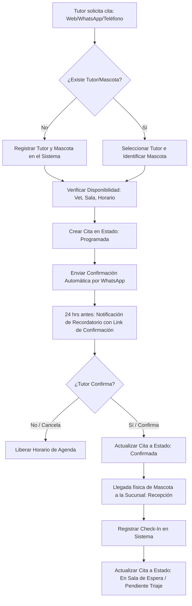
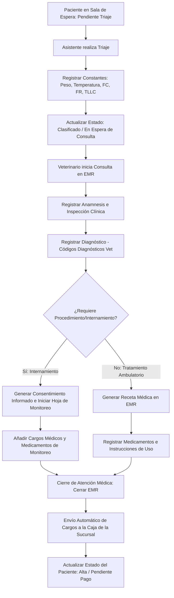
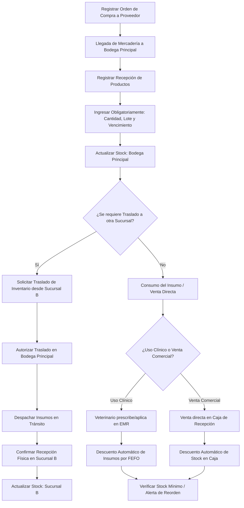
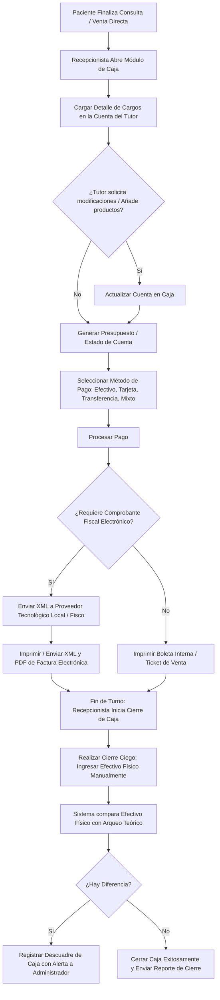

# MODELADO DE PROCESOS DE NEGOCIO: VetFlow SaaS
**Versión:** 1.0.0  
**Fecha:** 16 de Julio de 2026  
**Autor:** Enterprise Business Analyst

---

## 1. ANÁLISIS DE PROCESOS: AS-IS VS. TO-BE

El siguiente cuadro detalla la brecha operativa (Gap Analysis) entre el modelo tradicional fragmentado y manual (As-Is) y el modelo propuesto de VetFlow SaaS (To-Be).

| Proceso | Estado Actual (As-Is) | Estado Objetivo (To-Be) | Impacto y Justificación Comercial |
| :--- | :--- | :--- | :--- |
| **Gestión de Citas** | Citas anotadas en papel o Google Calendar sin validación de disponibilidad de veterinarios ni salas. Gran cantidad de inasistencias (*no-shows*). | Agenda centralizada con control de horarios de veterinarios, salas de cirugía y recordatorios automatizados vía WhatsApp Business API. | **Reducción de No-Shows en un 35%** y optimización del tiempo de los profesionales médicos. |
| **Admisión y Triaje** | El paciente ingresa en orden de llegada. Casos graves esperan en sala de espera junto a consultas rutinarias. No hay registro de signos vitales iniciales. | Recepción realiza el check-in; el asistente realiza un triaje estandarizado parametrizando constantes vitales. Casos graves se priorizan visualmente en pantalla. | **Mitigación de riesgo de muerte en sala de espera** y mayor orden en la atención de urgencias. |
| **Consulta y EMR** | Historial en fichas de papel o campos de texto libre no estructurados. Medicamentos aplicados se escriben a mano en una libreta de cargos. | Historia clínica modular estructurada (Anamnesis, Examen, Diagnóstico CIE-10/Vet, Receta). Cargos a facturación automáticos al prescribir o usar insumos. | **Eliminación de la pérdida de cargos (hasta 15% de fuga)** y registros clínicos inmutables ante auditorías. |
| **Farmacia e Inventario** | Hojas de cálculo locales actualizadas semanalmente. Desconocimiento de fechas de vencimiento y uso informal de insumos. | Inventario multi-bodega con control FEFO de lotes. Descuento automático de inventario al registrar consumo en consulta o cirugías en tiempo real. | **Reducción del costo de merma por vencimiento en un 80%** y control estricto de medicamentos controlados. |
| **Facturación y Caja** | La recepcionista suma manualmente los apuntes de la ficha de papel. La factura se hace en el portal web del gobierno de forma independiente. | Cuenta consolidada automática desde EMR. Facturación electrónica integrada con un solo clic. Cierre de caja ciego al final del turno. | **Reducción del tiempo de cobro de 15 a 2 minutos**, eliminación de cuadres artificiales y cumplimiento fiscal inmediato. |

---

## 2. FLUJO DE AGENDA Y CITAS (APPOINTMENT & ADMISSION)

Este proceso gestiona el ciclo desde que un tutor solicita una cita hasta que el paciente es admitido en la sucursal y pasa a la sala de espera.

### 2.1. Diagrama del Flujo de Reserva y Admisión

### 2.2. Descripción Detallada del Proceso y Excepciones
1.  **Reserva de Citas:** El recepcionista o el tutor (a través de un portal web de auto-servicio en planes Enterprise) busca un espacio disponible filtrando por Sucursal, Especialidad, Veterinario o Servicio.
2.  **Confirmación y Recordatorios:** VetFlow SaaS genera un webhook hacia el proveedor de mensajería (WhatsApp/Email) al crear la cita. El sistema programa un segundo mensaje de recordatorio 24 horas antes de la cita. El tutor puede confirmar o cancelar mediante botones interactivos en WhatsApp.
3.  **Check-In y Admisión:** Cuando el tutor llega a la clínica, el recepcionista valida los datos, confirma que el tutor no tenga saldos pendientes de pago de visitas anteriores (regla financiera: *alerta de deuda pendiente*) y cambia el estado de la cita a "En Sala de Espera".

---

## 3. FLUJO CLÍNICO INTEGRAL (EMR WORKFLOW)

El flujo clínico es el núcleo de VetFlow SaaS. Vincula al personal médico y asegura la calidad asistencial y el registro del cargo financiero de manera transparente.

### 3.1. Diagrama del Flujo Clínico

### 3.2. Descripción Detallada del Flujo Clínico
1.  **Triaje Clínico:** El asistente veterinario pesa a la mascota y registra sus constantes fisiológicas básicas: Temperatura (°C), Frecuencia Cardíaca (FC - lpm), Frecuencia Respiratoria (FR - rpm), Tiempo de Llenado Capilar (TLLC - seg), y Estado de Deshidratación (%).
2.  **Consulta Veterinaria:** El veterinario a cargo abre la consulta desde su panel. El sistema le despliega el historial previo de forma cronológica. El veterinario documenta la exploración por sistemas (digestivo, respiratorio, dermatológico, etc.).
3.  **Emisión de Recetas:** El veterinario prescribe medicamentos seleccionándolos directamente desde el Vademécum integrado (vinculado al inventario). Si prescribe un medicamento de uso controlado, el sistema exige ingresar la dosis exacta y genera un folio correlativo único de receta controlada.
4.  **Cierre Clínico (Inmutabilidad):** Al finalizar la atención, el veterinario hace clic en "Finalizar Consulta". La consulta queda sellada electrónicamente. Todos los procedimientos aplicados, medicamentos inyectados y honorarios médicos se transfieren instantáneamente a la cuenta del paciente (Caja) para evitar olvidos de cobro.

---

## 4. FLUJO DE GESTIÓN DE INVENTARIO Y CONSUMO

Este flujo asegura que cada insumo utilizado en la práctica clínica se descuente correctamente y que el stock físico coincida con el stock lógico de la base de datos multi-bodega.

### 4.1. Diagrama de Flujo de Inventario

### 4.2. Reglas de Control de Inventario y Alertas
*   **Traslado Multi-Sucursal:** Para evitar fugas en el transporte de mercancías, el traslado de inventario requiere dos pasos de validación: (1) Envío de la sucursal de origen (el stock queda en estado "En Tránsito"), y (2) Aprobación de entrada en la sucursal de destino (el stock ingresa efectivamente a la bodega local).
*   **Integración EMR-Inventario:** Cuando el veterinario registra un procedimiento clínico, por ejemplo, "Limpieza de heridas con sutura", el sistema asocia automáticamente un kit preconfigurado de insumos (jeringa, gasa, sutura, antiséptico) y descuenta sus unidades del inventario aplicando FEFO.

---

## 5. FLUJO DE FACTURACIÓN Y CIERRE DE CAJA MULTI-SUCURSAL

Este proceso maneja el dinero, la emisión de comprobantes fiscales y la auditoría de los flujos de caja diarios por sucursal.

### 5.1. Diagrama del Flujo Financiero y de Caja

### 5.2. Procesamiento de Pagos y Cierre de Turno
*   **Pagos Mixtos:** El sistema permite que una misma cuenta sea liquidada mediante múltiples métodos de pago (ej. 50% Efectivo, 50% Tarjeta de Crédito).
*   **Facturación Electrónica Adaptable:** El sistema cuenta con una capa de abstracción de impuestos y facturación que se conecta a proveedores tecnológicos locales autorizados. Al presionar "Facturar", la plataforma envía los datos de la venta y recibe el código de validación del fisco local (ej. timbre fiscal del SAT en México, firma digital en Colombia) de forma asíncrona en menos de 5 segundos.
*   **Cierre de Caja Ciego:** Previene malas prácticas. Si el recepcionista reporta $100 y el sistema calculó que debía haber $105, se genera una alerta automática de faltante de $5 que se envía por correo al Administrador del Tenant, impidiendo que el cajero manipule los registros para ocultar el descuadre.
