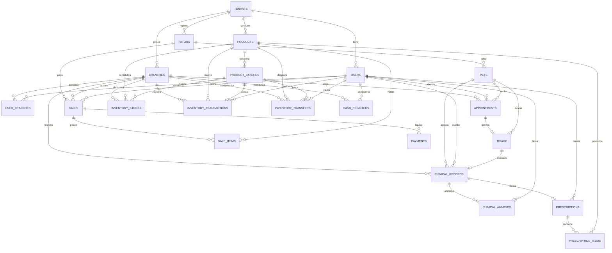

# Especificación del Esquema de Datos: VetFlow SaaS
**Versión:** 1.0.0  
**Fecha:** 16 de Julio de 2026  
**Autor:** Enterprise Data Architect  

---

## 1. Resumen de la Arquitectura de Datos y Enfoque Multi-Tenant

El diseño del modelo de datos de **VetFlow SaaS** adopta un enfoque relacional sobre **PostgreSQL**, optimizado para alta concurrencia, escalabilidad a millones de registros y cumplimiento estricto de normativas de salud e impositivas en Latinoamérica.

### 1.1. Estrategia de Aislamiento: Database-Level Row Level Security (RLS)
Para garantizar el aislamiento físico y lógico de los datos de cada clínica (*Tenant*) sin incurrir en los elevados costos y complejidad operativa de esquemas de bases de datos separadas (ideal para la fase MVP bajo el principio *Cost vs Value*), implementamos **PostgreSQL Row Level Security (RLS)** en una base de datos única.

```
       +--------------------------------------------+
       |           Framework API (NestJS/FastAPI)   |
       +---------------------+----------------------+
                             |
                   Set Local Transaction Context:
            "SET LOCAL app.current_tenant_id = 'uuid';"
                             |
                             v
       +--------------------------------------------+
       |              PostgreSQL Engine             |
       |  +--------------------------------------+  |
       |  | RLS Policy evaluation                |  |
       |  | WHERE tenant_id = app.curr_tenant_id |  |
       |  +------------------+-------------------+  |
       |                     |                      |
       |       +-------------+-------------+        |
       |       |                           |        |
       |       v                           v        |
       |  [Tenant A Data]             [Tenant B Data]
       +--------------------------------------------+
```

*   **Identificador Único Global (UUIDv4):** Todas las tablas utilizan UUIDv4 (`uuid`) como Llave Primaria (`PRIMARY KEY`). Esto previene la enumeración de ID por parte de atacantes, evita colisiones al sincronizar datos offline en dispositivos locales (*IndexedDB*) y simplifica una futura migración a esquemas shardeds si un cliente corporativo *Enterprise* lo requiere.
*   **Columna Discriminadora:** Cada tabla (a excepción de la tabla raíz `tenants` y tablas asociativas cruzadas) posee una columna `tenant_id UUID NOT NULL` indexada y vinculada mediante una Llave Foránea (`FOREIGN KEY`) a la tabla `tenants(id) ON DELETE CASCADE`.
*   **Contexto de Conexión:** La aplicación inyectará el `tenant_id` en el contexto de cada transacción SQL mediante una variable de sesión:
    ```sql
    SET LOCAL app.current_tenant_id = '366258be-039c-48c0-83cc-54655f412852';
    ```
    El uso de `SET LOCAL` asegura que el valor se destruya automáticamente cuando finalice la transacción (`COMMIT` o `ROLLBACK`), previniendo la fuga de datos por reutilización de conexiones en el pool.

---

## 2. Esquema de Aislamiento Multi-Tenant con RLS

A continuación se define la estructura genérica para habilitar RLS en cada tabla y las excepciones de administración global.

### 2.1. Habilitación de RLS y Política Genérica
Para cada tabla del sistema (con la excepción de `tenants`), se ejecutará el siguiente bloque DDL:

```sql
-- 1. Habilitar RLS en la tabla
ALTER TABLE nombre_tabla ENABLE ROW LEVEL SECURITY;

-- 2. Forzar RLS para el propietario de la tabla (opcional pero recomendado para desarrollo)
ALTER TABLE nombre_tabla FORCE ROW LEVEL SECURITY;

-- 3. Crear la política de aislamiento basada en la variable de sesión
CREATE POLICY tenant_isolation_policy ON nombre_tabla
    FOR ALL
    USING (
        tenant_id = NULLIF(current_setting('app.current_tenant_id', true), '')::uuid
    )
    WITH CHECK (
        tenant_id = NULLIF(current_setting('app.current_tenant_id', true), '')::uuid
    );
```

### 2.2. Política de Seguridad para la Tabla Raíz `tenants`
Dado que la tabla `tenants` almacena las clínicas suscritas y su llave primaria `id` es el `tenant_id` para el resto de las tablas, su política RLS restringe el acceso para que el inquilino solo pueda consultar su propio registro de suscripción:

```sql
ALTER TABLE tenants ENABLE ROW LEVEL SECURITY;

CREATE POLICY tenant_self_access_policy ON tenants
    FOR SELECT
    USING (
        id = NULLIF(current_setting('app.current_tenant_id', true), '')::uuid
    );
```

### 2.3. Bypass de RLS para Procesos Globales
Los procesos administrativos del SaaS (tales como la facturación mensual de la suscripción, backups generales o analíticas de negocio globales) se conectarán utilizando un rol de base de datos específico (`vetflow_superadmin`) al cual se le otorgará el bypass de RLS:

```sql
ALTER ROLE vetflow_superadmin BYPASSRLS;
```

---

## 3. Modelo Lógico de Datos (Diagrama y Cardinalidades)

### 3.1. Diagrama de Entidad-Relación (Mermaid)



### 3.2. Relaciones y Cardinalidades Clave
1.  **Tenants a Sucursales (`1:N`):** Un inquilino puede poseer múltiples sucursales físicas (multisede), pero una sucursal pertenece a un único tenant.
2.  **Tutores a Mascotas (`1:N`):** Un tutor legal puede ser responsable de varias mascotas. *Nota:* Por simplicidad en el MVP, se asume relación uno a muchos.
3.  **Cita a Triaje (`1:0..1`):** Una cita agendada puede o no generar un triaje preliminar.
4.  **Mascotas a Historial Clínico (`1:N`):** Una mascota tiene múltiples registros de evoluciones clínicas (EMR) acumulados en el tiempo.
5.  **Historial Clínico a Anexos (`1:N`):** Para mantener la inmutabilidad (BR-CL-001), una vez sellado el EMR, las correcciones o ampliaciones se agregan como anexos de solo lectura con marca de tiempo.
6.  **Productos a Lotes (`1:N`):** Los medicamentos u otros productos catalogados en inventario se dividen en diferentes lotes con fechas de vencimiento únicas.
7.  **Sucursales a Lotes/Productos (`N:M` a través de `inventory_stocks`):** Mapeo de inventario físico que consolida el stock disponible por sucursal, producto y lote.
8.  **Traslado de Stock (`1:N` de doble validación):** Relaciona dos sucursales (origen y destino) y requiere la firma de envío (creador) y recepción (validador).

---

## 4. Modelo Físico de Datos (Diccionario de Tablas)

### 4.1. Módulo: Configuración del Tenant y Multi-Sucursal

#### Tabla: `tenants`
Almacena el registro de los inquilinos suscriptores del SaaS.

| Columna | Tipo de Datos | Restricciones | Descripción |
| :--- | :--- | :--- | :--- |
| `id` | `UUID` | `PRIMARY KEY`, `DEFAULT gen_random_uuid()` | ID único del Tenant. |
| `name` | `VARCHAR(255)` | `NOT NULL` | Nombre comercial de la clínica o corporativo. |
| `plan_tier` | `VARCHAR(50)` | `NOT NULL`, `CHECK (plan_tier IN ('Starter', 'Professional', 'Enterprise'))` | Plan de suscripción contratado (Tier). |
| `status` | `VARCHAR(50)` | `NOT NULL`, `DEFAULT 'active'`, `CHECK (status IN ('active', 'suspended', 'cancelled'))` | Estado operativo de la suscripción. |
| `created_at` | `TIMESTAMPTZ` | `NOT NULL`, `DEFAULT CURRENT_TIMESTAMP` | Fecha y hora de registro inicial. |
| `updated_at` | `TIMESTAMPTZ` | `NOT NULL`, `DEFAULT CURRENT_TIMESTAMP` | Última actualización de datos. |

*   **Índices:**
    *   `idx_tenants_status`: B-Tree `(status)`. Optimiza la consulta de tenants activos para procesos asíncronos de facturación mensual.
*   **Políticas RLS:** RLS habilitado. Permite lectura a usuarios autenticados si su variable `app.current_tenant_id` coincide con el `id`.

---

#### Tabla: `branches`
Sucursales físicas pertenecientes a un Tenant.

| Columna | Tipo de Datos | Restricciones | Descripción |
| :--- | :--- | :--- | :--- |
| `id` | `UUID` | `PRIMARY KEY`, `DEFAULT gen_random_uuid()` | ID único de la sucursal. |
| `tenant_id` | `UUID` | `NOT NULL`, `REFERENCES tenants(id) ON DELETE CASCADE` | ID del tenant propietario. |
| `name` | `VARCHAR(255)` | `NOT NULL` | Nombre de la sucursal (Sede Norte, etc.). |
| `address` | `TEXT` | `NOT NULL` | Dirección física de la sucursal. |
| `country` | `VARCHAR(2)` | `NOT NULL` | Código de país ISO 3166-1 alpha-2 (ej. MX, CO, CL). |
| `currency` | `VARCHAR(3)` | `NOT NULL`, `DEFAULT 'USD'` | Divisa de operación local ISO 4217 (BR-FIN-001). |
| `tax_identifier` | `VARCHAR(50)` | `NOT NULL` | Identificación fiscal (RUT, RUC, RFC) para facturación local. |
| `is_active` | `BOOLEAN` | `NOT NULL`, `DEFAULT TRUE` | Estado lógico de la sucursal. |
| `created_at` | `TIMESTAMPTZ` | `NOT NULL`, `DEFAULT CURRENT_TIMESTAMP` | Fecha de creación. |
| `updated_at` | `TIMESTAMPTZ` | `NOT NULL`, `DEFAULT CURRENT_TIMESTAMP` | Última actualización. |

*   **Índices:**
    *   `idx_branches_tenant`: B-Tree `(tenant_id, is_active)`. Optimiza búsquedas de sucursales activas de un inquilino.
*   **Políticas RLS:** RLS habilitado. Filtrado estricto por `tenant_id`.

---

#### Tabla: `users`
Usuarios y personal de las veterinarias del Tenant con control de acceso por rol (RBAC).

| Columna | Tipo de Datos | Restricciones | Descripción |
| :--- | :--- | :--- | :--- |
| `id` | `UUID` | `PRIMARY KEY`, `DEFAULT gen_random_uuid()` | ID único de usuario. |
| `tenant_id` | `UUID` | `NOT NULL`, `REFERENCES tenants(id) ON DELETE CASCADE` | ID del tenant. |
| `email` | `VARCHAR(255)` | `NOT NULL` | Correo electrónico de inicio de sesión. |
| `name` | `VARCHAR(255)` | `NOT NULL` | Nombre completo del usuario. |
| `role` | `VARCHAR(50)` | `NOT NULL`, `CHECK (role IN ('SuperAdmin', 'TenantOwner', 'DirectorClinico', 'Veterinario', 'Recepcionista', 'Farmaceutico'))` | Rol en el sistema (RBAC). |
| `professional_license` | `VARCHAR(100)` | `NULL` | Cédula, matrícula o registro profesional vigente (BR-CL-002). |
| `is_active` | `BOOLEAN` | `NOT NULL`, `DEFAULT TRUE` | Estado lógico del usuario. |
| `created_at` | `TIMESTAMPTZ` | `NOT NULL`, `DEFAULT CURRENT_TIMESTAMP` | Fecha de registro. |
| `updated_at` | `TIMESTAMPTZ` | `NOT NULL`, `DEFAULT CURRENT_TIMESTAMP` | Última modificación. |

*   **Índices:**
    *   `uq_users_tenant_email`: UNIQUE B-Tree `(tenant_id, email)`. Asegura emails únicos por tenant.
    *   `idx_users_role`: B-Tree `(tenant_id, role)`. Acelera la búsqueda de veterinarios disponibles para la agenda.
*   **Políticas RLS:** RLS habilitado. Filtrado por `tenant_id`.

---

#### Tabla: `user_branches`
Tabla asociativa muchos a muchos para vincular personal a múltiples sucursales (ej. veterinarios itinerantes).

| Columna | Tipo de Datos | Restricciones | Descripción |
| :--- | :--- | :--- | :--- |
| `tenant_id` | `UUID` | `NOT NULL`, `REFERENCES tenants(id) ON DELETE CASCADE` | ID del tenant. |
| `user_id` | `UUID` | `NOT NULL`, `REFERENCES users(id) ON DELETE CASCADE` | ID del usuario. |
| `branch_id` | `UUID` | `NOT NULL`, `REFERENCES branches(id) ON DELETE CASCADE` | ID de la sucursal. |
| `created_at` | `TIMESTAMPTZ` | `NOT NULL`, `DEFAULT CURRENT_TIMESTAMP` | Fecha de asignación. |

*   **Índices:**
    *   `pk_user_branches`: PRIMARY KEY B-Tree `(user_id, branch_id)`.
    *   `idx_user_branches_composite`: B-Tree `(tenant_id, branch_id, user_id)`. Optimiza la verificación de accesos del usuario.
*   **Políticas RLS:** RLS habilitado. Filtrado por `tenant_id`.

---

### 4.2. Módulo: Gestión de Pacientes y Tutores

#### Tabla: `tutors`
Clientes de la clínica que ejercen la tutoría legal de las mascotas.

| Columna | Tipo de Datos | Restricciones | Descripción |
| :--- | :--- | :--- | :--- |
| `id` | `UUID` | `PRIMARY KEY`, `DEFAULT gen_random_uuid()` | ID único del tutor. |
| `tenant_id` | `UUID` | `NOT NULL`, `REFERENCES tenants(id) ON DELETE CASCADE` | ID del tenant. |
| `first_name` | `VARCHAR(100)` | `NOT NULL` | Nombre del tutor. |
| `last_name` | `VARCHAR(100)` | `NOT NULL` | Apellido del tutor. |
| `email` | `VARCHAR(255)` | `NULL` | Correo electrónico de contacto. |
| `phone` | `VARCHAR(30)` | `NOT NULL` | Teléfono en formato internacional para WhatsApp (HU-01). |
| `tax_identifier` | `VARCHAR(50)` | `NULL` | ID tributario para facturación. |
| `address` | `TEXT` | `NULL` | Dirección de domicilio. |
| `is_active` | `BOOLEAN` | `NOT NULL`, `DEFAULT TRUE` | Estado lógico del registro. |
| `created_at` | `TIMESTAMPTZ` | `NOT NULL`, `DEFAULT CURRENT_TIMESTAMP` | Fecha de registro. |
| `updated_at` | `TIMESTAMPTZ` | `NOT NULL`, `DEFAULT CURRENT_TIMESTAMP` | Última modificación. |

*   **Índices:**
    *   `idx_tutors_search`: B-Tree `(tenant_id, last_name, first_name)`. Búsqueda por apellidos/nombres en recepción.
    *   `idx_tutors_phone`: B-Tree `(tenant_id, phone)`. Búsqueda rápida por teléfono en webhook de WhatsApp.
*   **Políticas RLS:** RLS habilitado. Filtrado por `tenant_id`.

> [!NOTE]
> De acuerdo al requerimiento no funcional **RNF 1.2**, si el país de operación exige encriptación a nivel de base de datos de datos de contacto (GDPR/Ley 1581/LFPDPPP), las columnas `email` y `phone` deberán encriptarse en la capa de aplicación o mediante `pgcrypto` (con llaves asimétricas administradas externamente).

---

#### Tabla: `pets`
Pacientes veterinarios (mascotas).

| Columna | Tipo de Datos | Restricciones | Descripción |
| :--- | :--- | :--- | :--- |
| `id` | `UUID` | `PRIMARY KEY`, `DEFAULT gen_random_uuid()` | ID único de la mascota. |
| `tenant_id` | `UUID` | `NOT NULL`, `REFERENCES tenants(id) ON DELETE CASCADE` | ID del tenant. |
| `tutor_id` | `UUID` | `NOT NULL`, `REFERENCES tutors(id) ON DELETE RESTRICT` | Tutor responsable de la mascota. |
| `name` | `VARCHAR(100)` | `NOT NULL` | Nombre del paciente. |
| `species` | `VARCHAR(50)` | `NOT NULL` | Especie (ej. Perro, Gato, Loro). |
| `breed` | `VARCHAR(100)` | `NULL` | Raza de la mascota. |
| `gender` | `VARCHAR(10)` | `NOT NULL`, `CHECK (gender IN ('Macho', 'Hembra', 'Desconocido'))` | Género biológico. |
| `birth_date` | `DATE` | `NULL` | Fecha de nacimiento estimada o exacta. |
| `status` | `VARCHAR(50)` | `NOT NULL`, `DEFAULT 'Activo'`, `CHECK (status IN ('Activo', 'En Cirugia', 'Hospitalizado', 'Fallecido', 'Inactivo'))` | Estado clínico-operativo de la mascota (BR-CL-003). |
| `is_active` | `BOOLEAN` | `NOT NULL`, `DEFAULT TRUE` | Eliminación lógica de mascota. |
| `created_at` | `TIMESTAMPTZ` | `NOT NULL`, `DEFAULT CURRENT_TIMESTAMP` | Registro inicial. |
| `updated_at` | `TIMESTAMPTZ` | `NOT NULL`, `DEFAULT CURRENT_TIMESTAMP` | Última actualización. |

*   **Índices:**
    *   `idx_pets_tutor`: B-Tree `(tenant_id, tutor_id)`. Muestra rápido las mascotas de un tutor en recepción.
    *   `idx_pets_search`: B-Tree `(tenant_id, name)`. Acelera la búsqueda de expedientes clínicos por nombre.
*   **Políticas RLS:** RLS habilitado. Filtrado por `tenant_id`.

---

### 4.3. Módulo: Agenda, Citas y Triaje

#### Tabla: `appointments`
Programación de turnos de consulta y procedimientos.

| Columna | Tipo de Datos | Restricciones | Descripción |
| :--- | :--- | :--- | :--- |
| `id` | `UUID` | `PRIMARY KEY`, `DEFAULT gen_random_uuid()` | ID único de la cita. |
| `tenant_id` | `UUID` | `NOT NULL`, `REFERENCES tenants(id) ON DELETE CASCADE` | ID del tenant. |
| `branch_id` | `UUID` | `NOT NULL`, `REFERENCES branches(id) ON DELETE RESTRICT` | Sucursal física. |
| `pet_id` | `UUID` | `NOT NULL`, `REFERENCES pets(id) ON DELETE RESTRICT` | Mascota atendida. |
| `veterinarian_id` | `UUID` | `NOT NULL`, `REFERENCES users(id) ON DELETE RESTRICT` | Veterinario asignado. |
| `appointment_date` | `TIMESTAMPTZ` | `NOT NULL` | Fecha y hora reservada. |
| `status` | `VARCHAR(50)` | `NOT NULL`, `DEFAULT 'Programada'`, `CHECK (status IN ('Programada', 'Confirmada', 'Triaje', 'Atendida', 'Cancelada', 'No Presento'))` | Estado de flujo de la cita (HU-01). |
| `reason_for_visit` | `TEXT` | `NOT NULL` | Sintomatología o razón de cita indicada por tutor. |
| `created_at` | `TIMESTAMPTZ` | `NOT NULL`, `DEFAULT CURRENT_TIMESTAMP` | Fecha de creación de registro. |
| `updated_at` | `TIMESTAMPTZ` | `NOT NULL`, `DEFAULT CURRENT_TIMESTAMP` | Última actualización de registro. |

*   **Índices:**
    *   `idx_appointments_branch_date`: B-Tree `(tenant_id, branch_id, appointment_date)`. Optimiza la carga de la agenda diaria de la sucursal (< 1.2 segundos según RNF 3.1).
    *   `uq_appointments_no_overlap`: UNIQUE B-Tree `(tenant_id, veterinarian_id, appointment_date) WHERE (status IN ('Programada', 'Confirmada', 'Triaje'))`. **(BR-CL-004 / HU-01.2)**: Evita por completo la reserva duplicada (solapamiento) de horario para el mismo veterinario en estados activos.
*   **Políticas RLS:** RLS habilitado. Filtrado por `tenant_id`.

---

#### Tabla: `triage`
Registro clínico inicial (Triaje) previo al ingreso a consulta.

| Columna | Tipo de Datos | Restricciones | Descripción |
| :--- | :--- | :--- | :--- |
| `id` | `UUID` | `PRIMARY KEY`, `DEFAULT gen_random_uuid()` | ID único del triaje. |
| `tenant_id` | `UUID` | `NOT NULL`, `REFERENCES tenants(id) ON DELETE CASCADE` | ID del tenant. |
| `appointment_id` | `UUID` | `NULL`, `REFERENCES appointments(id) ON DELETE SET NULL` | Cita origen del triaje. |
| `pet_id` | `UUID` | `NOT NULL`, `REFERENCES pets(id) ON DELETE RESTRICT` | Mascota evaluada. |
| `temperature` | `NUMERIC(4,2)` | `NULL` | Temperatura de la mascota (ej. 38.50 °C). |
| `heart_rate` | `INTEGER` | `NULL` | Frecuencia cardíaca en latidos por minuto. |
| `respiratory_rate`| `INTEGER` | `NULL` | Frecuencia respiratoria en respiraciones por minuto. |
| `weight` | `NUMERIC(6,3)` | `NOT NULL` | Peso registrado al ingresar en Kg (ej. 12.350 Kg). |
| `triage_level` | `VARCHAR(50)` | `NOT NULL`, `CHECK (triage_level IN ('Emergencia', 'Urgencia', 'Consulta Rotativa', 'Control'))` | Gravedad asignada del paciente. |
| `reason` | `TEXT` | `NOT NULL` | Breve descripción de los síntomas. |
| `created_by` | `UUID` | `NOT NULL`, `REFERENCES users(id) ON DELETE RESTRICT` | Recepcionista o técnico que realiza triaje. |
| `created_at` | `TIMESTAMPTZ` | `NOT NULL`, `DEFAULT CURRENT_TIMESTAMP` | Fecha de registro. |

*   **Índices:**
    *   `idx_triage_pet`: B-Tree `(tenant_id, pet_id)`. Para recuperar históricos de constantes vitales rápidos.
*   **Políticas RLS:** RLS habilitado. Filtrado por `tenant_id`.

---

### 4.4. Módulo: Historial Clínico Electrónico (EMR) e Inmutabilidad

#### Tabla: `clinical_records`
Ficha de evolución de consulta clínica veterinaria.

| Columna | Tipo de Datos | Restricciones | Descripción |
| :--- | :--- | :--- | :--- |
| `id` | `UUID` | `PRIMARY KEY`, `DEFAULT gen_random_uuid()` | ID único del registro clínico. |
| `tenant_id` | `UUID` | `NOT NULL`, `REFERENCES tenants(id) ON DELETE CASCADE` | ID del tenant. |
| `pet_id` | `UUID` | `NOT NULL`, `REFERENCES pets(id) ON DELETE RESTRICT` | Mascota atendida. |
| `branch_id` | `UUID` | `NOT NULL`, `REFERENCES branches(id) ON DELETE RESTRICT` | Sucursal de la consulta. |
| `veterinarian_id` | `UUID` | `NOT NULL`, `REFERENCES users(id) ON DELETE RESTRICT` | Veterinario emisor. |
| `triage_id` | `UUID` | `NULL`, `REFERENCES triage(id) ON DELETE SET NULL` | Triaje asociado. |
| `anamnesis` | `TEXT` | `NOT NULL` | Síntomas descritos por tutor. |
| `physical_examination`| `TEXT` | `NOT NULL` | Notas del examen físico. |
| `diagnosis` | `TEXT` | `NOT NULL` | Diagnóstico clínico final. |
| `treatment_plan` | `TEXT` | `NULL` | Tratamiento y recomendaciones médicas. |
| `status` | `VARCHAR(50)` | `NOT NULL`, `DEFAULT 'Abierto'`, `CHECK (status IN ('Abierto', 'Cerrado'))` | Estado de inmutabilidad (HU-02 / BR-CL-001). |
| `consent_signed` | `BOOLEAN` | `NOT NULL`, `DEFAULT FALSE` | Indicador de firma de consentimiento (BR-CL-003). |
| `closed_at` | `TIMESTAMPTZ` | `NULL` | Fecha de sellado clínico. |
| `created_at` | `TIMESTAMPTZ` | `NOT NULL`, `DEFAULT CURRENT_TIMESTAMP` | Fecha de creación de registro. |
| `updated_at` | `TIMESTAMPTZ` | `NOT NULL`, `DEFAULT CURRENT_TIMESTAMP` | Última actualización. |

*   **Índices:**
    *   `idx_clinical_records_pet`: B-Tree `(tenant_id, pet_id, created_at DESC)`. Permite cargar la ficha cronológica de EMR en menos de 800ms (RNF 3.1).
*   **Políticas RLS:** RLS habilitado. Filtrado por `tenant_id`.

---

#### Tabla: `clinical_annexes`
Anexos inmutables de adiciones o correcciones clínicas de una consulta ya cerrada.

| Columna | Tipo de Datos | Restricciones | Descripción |
| :--- | :--- | :--- | :--- |
| `id` | `UUID` | `PRIMARY KEY`, `DEFAULT gen_random_uuid()` | ID de anexo. |
| `tenant_id` | `UUID` | `NOT NULL`, `REFERENCES tenants(id) ON DELETE CASCADE` | ID del tenant. |
| `clinical_record_id`| `UUID` | `NOT NULL`, `REFERENCES clinical_records(id) ON DELETE RESTRICT` | Registro EMR al que adiciona. |
| `veterinarian_id` | `UUID` | `NOT NULL`, `REFERENCES users(id) ON DELETE RESTRICT` | Veterinario que firma la adición. |
| `content` | `TEXT` | `NOT NULL` | Contenido de la nota posterior. |
| `created_at` | `TIMESTAMPTZ` | `NOT NULL`, `DEFAULT CURRENT_TIMESTAMP` | Fecha y hora inalterable del anexo. |

*   **Índices:**
    *   `idx_clinical_annexes_record`: B-Tree `(tenant_id, clinical_record_id)`. Agrupa los anexos de la consulta principal.
*   **Políticas RLS:** RLS habilitado. Filtrado por `tenant_id`.

---

#### Tabla: `prescriptions`
Firma y emisión de recetas médicas.

| Columna | Tipo de Datos | Restricciones | Descripción |
| :--- | :--- | :--- | :--- |
| `id` | `UUID` | `PRIMARY KEY`, `DEFAULT gen_random_uuid()` | ID único de la receta. |
| `tenant_id` | `UUID` | `NOT NULL`, `REFERENCES tenants(id) ON DELETE CASCADE` | ID del tenant. |
| `clinical_record_id`| `UUID` | `NOT NULL`, `REFERENCES clinical_records(id) ON DELETE RESTRICT` | Consulta EMR de origen. |
| `veterinarian_id` | `UUID` | `NOT NULL`, `REFERENCES users(id) ON DELETE RESTRICT` | Veterinario prescriptor. |
| `prescription_number`| `VARCHAR(50)` | `NOT NULL` | Folio único correlativo por país/sede (HU-03). |
| `is_controlled` | `BOOLEAN` | `NOT NULL`, `DEFAULT FALSE` | Flag de control para estupefacientes (BR-INV-002). |
| `created_at` | `TIMESTAMPTZ` | `NOT NULL`, `DEFAULT CURRENT_TIMESTAMP` | Fecha de prescripción. |

*   **Índices:**
    *   `uq_prescriptions_number`: UNIQUE B-Tree `(tenant_id, prescription_number)`. Garantiza que no existan folios de recetas repetidos en el tenant.
*   **Políticas RLS:** RLS habilitado. Filtrado por `tenant_id`.

---

#### Tabla: `prescription_items`
Detalle de medicamentos y dosificaciones dentro de la receta.

| Columna | Tipo de Datos | Restricciones | Descripción |
| :--- | :--- | :--- | :--- |
| `id` | `UUID` | `PRIMARY KEY`, `DEFAULT gen_random_uuid()` | ID único del ítem de receta. |
| `tenant_id` | `UUID` | `NOT NULL`, `REFERENCES tenants(id) ON DELETE CASCADE` | ID del tenant. |
| `prescription_id` | `UUID` | `NOT NULL`, `REFERENCES prescriptions(id) ON DELETE CASCADE` | Receta a la que pertenece. |
| `product_id` | `UUID` | `NOT NULL`, `REFERENCES products(id) ON DELETE RESTRICT` | Medicamento del vademécum. |
| `dosage` | `TEXT` | `NOT NULL` | Instrucciones: dosis, vía, frecuencia, días (ej. "1 tableta cada 8 horas por 5 días"). |
| `quantity` | `NUMERIC(8,2)` | `NOT NULL` | Cantidad total a dispensar de unidades. |

*   **Políticas RLS:** RLS habilitado. Filtrado por `tenant_id`.

---

### 4.5. Módulo: Inventario y Vademécum

#### Tabla: `products`
Catálogo maestro de medicamentos y servicios (Vademécum de la clínica).

| Columna | Tipo de Datos | Restricciones | Descripción |
| :--- | :--- | :--- | :--- |
| `id` | `UUID` | `PRIMARY KEY`, `DEFAULT gen_random_uuid()` | ID único del producto. |
| `tenant_id` | `UUID` | `NOT NULL`, `REFERENCES tenants(id) ON DELETE CASCADE` | ID del tenant. |
| `sku` | `VARCHAR(100)` | `NOT NULL` | Código único de control de stock/barras. |
| `name` | `VARCHAR(255)` | `NOT NULL` | Nombre comercial del fármaco/servicio. |
| `description` | `TEXT` | `NULL` | Descripción y principio activo. |
| `category` | `VARCHAR(50)` | `NOT NULL`, `CHECK (category IN ('Medicamento', 'Medicamento Controlado', 'Insumo', 'Servicio', 'Alimento', 'Otros'))` | Clasificación del producto. |
| `is_controlled` | `BOOLEAN` | `NOT NULL`, `DEFAULT FALSE` | Redundancia controlada para validación en recetas. |
| `requires_prescription`| `BOOLEAN` | `NOT NULL`, `DEFAULT FALSE` | Requiere receta de veterinario matriculado. |
| `unit_of_measure` | `VARCHAR(50)` | `NOT NULL` | Unidad de dispensación (ej. tableta, ml, ampolla). |
| `is_active` | `BOOLEAN` | `NOT NULL`, `DEFAULT TRUE` | Estado lógico del producto. |
| `created_at` | `TIMESTAMPTZ` | `NOT NULL`, `DEFAULT CURRENT_TIMESTAMP` | Fecha de creación. |
| `updated_at` | `TIMESTAMPTZ` | `NOT NULL`, `DEFAULT CURRENT_TIMESTAMP` | Última actualización. |

*   **Índices:**
    *   `uq_products_sku`: UNIQUE B-Tree `(tenant_id, sku)`. Asegura SKU irrepetible por inquilino.
    *   `idx_products_category`: B-Tree `(tenant_id, category)`. Agrupa por medicamentos y servicios.
*   **Políticas RLS:** RLS habilitado. Filtrado por `tenant_id`.

---

#### Tabla: `product_batches`
Registro de lotes específicos de medicamentos recibidos.

| Columna | Tipo de Datos | Restricciones | Descripción |
| :--- | :--- | :--- | :--- |
| `id` | `UUID` | `PRIMARY KEY`, `DEFAULT gen_random_uuid()` | ID único de lote. |
| `tenant_id` | `UUID` | `NOT NULL`, `REFERENCES tenants(id) ON DELETE CASCADE` | ID del tenant. |
| `product_id` | `UUID` | `NOT NULL`, `REFERENCES products(id) ON DELETE RESTRICT` | Producto del lote. |
| `batch_number` | `VARCHAR(100)` | `NOT NULL` | Código o código de lote del fabricante. |
| `expiration_date` | `DATE` | `NOT NULL` | Fecha de vencimiento obligatoria (BR-INV-003). |
| `created_at` | `TIMESTAMPTZ` | `NOT NULL`, `DEFAULT CURRENT_TIMESTAMP` | Fecha de ingreso del lote. |

*   **Índices:**
    *   `uq_product_batches_num`: UNIQUE B-Tree `(tenant_id, product_id, batch_number)`. Evita duplicidad del mismo lote del mismo producto.
    *   `idx_product_batches_fefo`: B-Tree `(tenant_id, product_id, expiration_date ASC)`. **(BR-INV-001 / HU-04)**: Optimiza la consulta y ordenamiento de lotes con vencimientos más cercanos para lógica FEFO.
*   **Políticas RLS:** RLS habilitado. Filtrado por `tenant_id`.

---

#### Tabla: `inventory_stocks`
Inventario físico consolidado por sucursal, producto y lote.

| Columna | Tipo de Datos | Restricciones | Descripción |
| :--- | :--- | :--- | :--- |
| `tenant_id` | `UUID` | `NOT NULL`, `REFERENCES tenants(id) ON DELETE CASCADE` | ID del tenant. |
| `branch_id` | `UUID` | `NOT NULL`, `REFERENCES branches(id) ON DELETE RESTRICT` | Sucursal física. |
| `product_id` | `UUID` | `NOT NULL`, `REFERENCES products(id) ON DELETE RESTRICT` | Producto en stock. |
| `batch_id` | `UUID` | `NOT NULL`, `REFERENCES product_batches(id) ON DELETE RESTRICT` | Lote del producto. |
| `quantity` | `NUMERIC(12,4)`| `NOT NULL`, `DEFAULT 0.0000`, `CHECK (quantity >= 0)` | Stock disponible de precisión (ej. 1.2500 litros). |

*   **Índices:**
    *   `pk_inventory_stocks`: PRIMARY KEY B-Tree `(branch_id, product_id, batch_id)`.
    *   `idx_inventory_stocks_tenant`: B-Tree `(tenant_id, branch_id, product_id)`. Optimiza la verificación de inventario en bodega por producto.
*   **Políticas RLS:** RLS habilitado. Filtrado por `tenant_id`.

---

#### Tabla: `inventory_transactions`
Histórico de movimientos de inventario (auditoría completa y mermas).

| Columna | Tipo de Datos | Restricciones | Descripción |
| :--- | :--- | :--- | :--- |
| `id` | `UUID` | `PRIMARY KEY`, `DEFAULT gen_random_uuid()` | ID de transacción. |
| `tenant_id` | `UUID` | `NOT NULL`, `REFERENCES tenants(id) ON DELETE CASCADE` | ID del tenant. |
| `branch_id` | `UUID` | `NOT NULL`, `REFERENCES branches(id) ON DELETE RESTRICT` | Sucursal afectada. |
| `product_id` | `UUID` | `NOT NULL`, `REFERENCES products(id) ON DELETE RESTRICT` | Producto movido. |
| `batch_id` | `UUID` | `NULL`, `REFERENCES product_batches(id) ON DELETE RESTRICT` | Lote de producto (opcional para servicios). |
| `quantity` | `NUMERIC(12,4)`| `NOT NULL` | Cantidad de movimiento (+ compras, - despachos). |
| `transaction_type`| `VARCHAR(50)` | `NOT NULL`, `CHECK (transaction_type IN ('Compra', 'Consumo Clinico', 'Traslado Entrada', 'Traslado Salida', 'Ajuste Merma', 'Ajuste Faltante'))` | Tipo de movimiento. |
| `reference_id` | `UUID` | `NULL` | ID de referencia (venta, receta, traslado). |
| `notes` | `TEXT` | `NULL` | Nota de justificación (obligatoria para ajustes por BR-INV-004). |
| `created_by` | `UUID` | `NOT NULL`, `REFERENCES users(id) ON DELETE RESTRICT` | Usuario que registra movimiento. |
| `created_at` | `TIMESTAMPTZ` | `NOT NULL`, `DEFAULT CURRENT_TIMESTAMP` | Fecha de la transacción. |

*   **Índices:**
    *   `idx_inv_transactions_ref`: B-Tree `(tenant_id, reference_id)`. Enlaza transacciones con la venta o receta origen.
*   **Políticas RLS:** RLS habilitado. Filtrado por `tenant_id`.

---

#### Tabla: `inventory_transfers`
Proceso de envío y recepción de mercancía entre sucursales (doble validación).

| Columna | Tipo de Datos | Restricciones | Descripción |
| :--- | :--- | :--- | :--- |
| `id` | `UUID` | `PRIMARY KEY`, `DEFAULT gen_random_uuid()` | ID del traslado. |
| `tenant_id` | `UUID` | `NOT NULL`, `REFERENCES tenants(id) ON DELETE CASCADE` | ID del tenant. |
| `source_branch_id`| `UUID` | `NOT NULL`, `REFERENCES branches(id) ON DELETE RESTRICT` | Sucursal origen (despacho). |
| `destination_branch_id`| `UUID`| `NOT NULL`, `REFERENCES branches(id) ON DELETE RESTRICT` | Sucursal destino (recepción). |
| `product_id` | `UUID` | `NOT NULL`, `REFERENCES products(id) ON DELETE RESTRICT` | Producto trasladado. |
| `batch_id` | `UUID` | `NOT NULL`, `REFERENCES product_batches(id) ON DELETE RESTRICT` | Lote del producto. |
| `quantity` | `NUMERIC(12,4)`| `NOT NULL`, `CHECK (quantity > 0)` | Cantidad a transferir. |
| `status` | `VARCHAR(50)` | `NOT NULL`, `DEFAULT 'En Transito'`, `CHECK (status IN ('En Transito', 'Completado', 'Cancelado'))` | Estado del traslado (HU-06). |
| `created_by` | `UUID` | `NOT NULL`, `REFERENCES users(id) ON DELETE RESTRICT` | Encargado que realiza el envío. |
| `received_by` | `UUID` | `NULL`, `REFERENCES users(id) ON DELETE RESTRICT` | Encargado de sucursal destino que recibe. |
| `sent_at` | `TIMESTAMPTZ` | `NOT NULL`, `DEFAULT CURRENT_TIMESTAMP` | Fecha de envío. |
| `received_at` | `TIMESTAMPTZ` | `NULL` | Fecha de recepción confirmada. |

*   **Índices:**
    *   `idx_inv_transfers_status`: B-Tree `(tenant_id, status)`. Optimiza la carga de traslados pendientes de recepción por sucursal.
*   **Políticas RLS:** RLS habilitado. Filtrado por `tenant_id`.

---

### 4.6. Módulo: Ventas, Facturación y Caja

#### Tabla: `sales`
Encabezado de cuentas y comprobantes de cobro.

| Columna | Tipo de Datos | Restricciones | Descripción |
| :--- | :--- | :--- | :--- |
| `id` | `UUID` | `PRIMARY KEY`, `DEFAULT gen_random_uuid()` | ID de la venta. |
| `tenant_id` | `UUID` | `NOT NULL`, `REFERENCES tenants(id) ON DELETE CASCADE` | ID del tenant. |
| `branch_id` | `UUID` | `NOT NULL`, `REFERENCES branches(id) ON DELETE RESTRICT` | Sucursal donde se genera la venta. |
| `tutor_id` | `UUID` | `NOT NULL`, `REFERENCES tutors(id) ON DELETE RESTRICT` | Tutor cliente. |
| `cashier_id` | `UUID` | `NOT NULL`, `REFERENCES users(id) ON DELETE RESTRICT` | Cajero que cobra. |
| `total_amount` | `NUMERIC(12,2)`| `NOT NULL`, `DEFAULT 0.00` | Monto total acumulado de venta. |
| `status` | `VARCHAR(50)` | `NOT NULL`, `DEFAULT 'Pendiente'`, `CHECK (status IN ('Pendiente', 'Pagada', 'Anulada'))` | Estado financiero de la cuenta. |
| `invoice_number` | `VARCHAR(100)` | `NULL` | Folio de comprobante fiscal electrónico local (BR-FIN-003). |
| `invoice_status` | `VARCHAR(50)` | `NOT NULL`, `DEFAULT 'No Facturado'`, `CHECK (invoice_status IN ('No Facturado', 'Emitido', 'Error', 'Rechazado'))` | Estado del XML fiscal local. |
| `created_at` | `TIMESTAMPTZ` | `NOT NULL`, `DEFAULT CURRENT_TIMESTAMP` | Fecha de registro. |
| `updated_at` | `TIMESTAMPTZ` | `NOT NULL`, `DEFAULT CURRENT_TIMESTAMP` | Última modificación. |

*   **Índices:**
    *   `idx_sales_branch_date`: B-Tree `(tenant_id, branch_id, created_at)`. Reportes de ventas del día por caja.
    *   `idx_sales_invoice`: B-Tree `(tenant_id, invoice_number) WHERE (invoice_number IS NOT NULL)`. Búsqueda rápida de facturas emitidas.
*   **Políticas RLS:** RLS habilitado. Filtrado por `tenant_id`.

---

#### Tabla: `sale_items`
Detalle de artículos y servicios vendidos.

| Columna | Tipo de Datos | Restricciones | Descripción |
| :--- | :--- | :--- | :--- |
| `id` | `UUID` | `PRIMARY KEY`, `DEFAULT gen_random_uuid()` | ID de ítem de venta. |
| `tenant_id` | `UUID` | `NOT NULL`, `REFERENCES tenants(id) ON DELETE CASCADE` | ID del tenant. |
| `sale_id` | `UUID` | `NOT NULL`, `REFERENCES sales(id) ON DELETE CASCADE` | Cabecera de venta. |
| `product_id` | `UUID` | `NOT NULL`, `REFERENCES products(id) ON DELETE RESTRICT` | Producto o servicio cobrado. |
| `quantity` | `NUMERIC(10,2)`| `NOT NULL`, `CHECK (quantity > 0)` | Cantidad vendida. |
| `unit_price` | `NUMERIC(12,2)`| `NOT NULL` | Precio cobrado sin impuesto. |
| `subtotal` | `NUMERIC(12,2)`| `NOT NULL` | Subtotal (precio * cantidad). |
| `tax_amount` | `NUMERIC(12,2)`| `NOT NULL`, `DEFAULT 0.00` | Impuesto calculado (ej. IVA/IGV). |
| `created_at` | `TIMESTAMPTZ` | `NOT NULL`, `DEFAULT CURRENT_TIMESTAMP` | Fecha de registro. |

*   **Políticas RLS:** RLS habilitado. Filtrado por `tenant_id`.

---

#### Tabla: `payments`
Registro de pagos parciales o mixtos (HU-04) sobre la cuenta de la venta.

| Columna | Tipo de Datos | Restricciones | Descripción |
| :--- | :--- | :--- | :--- |
| `id` | `UUID` | `PRIMARY KEY`, `DEFAULT gen_random_uuid()` | ID de pago. |
| `tenant_id` | `UUID` | `NOT NULL`, `REFERENCES tenants(id) ON DELETE CASCADE` | ID del tenant. |
| `sale_id` | `UUID` | `NOT NULL`, `REFERENCES sales(id) ON DELETE CASCADE` | Venta asociada. |
| `payment_method` | `VARCHAR(50)` | `NOT NULL`, `CHECK (payment_method IN ('Efectivo', 'Tarjeta Debito', 'Tarjeta Credito', 'MercadoPago', 'Kushki', 'Transferencia'))` | Método de pago utilizado (HU-14). |
| `amount` | `NUMERIC(12,2)`| `NOT NULL`, `CHECK (amount > 0)` | Monto parcial o total abonado. |
| `transaction_reference`| `VARCHAR(255)`| `NULL` | Folio de transacción de pasarela o tarjeta. |
| `created_at` | `TIMESTAMPTZ` | `NOT NULL`, `DEFAULT CURRENT_TIMESTAMP` | Fecha del cobro. |

*   **Índices:**
    *   `idx_payments_sale`: B-Tree `(tenant_id, sale_id)`. Recupera los abonos y pagos de una venta.
*   **Políticas RLS:** RLS habilitado. Filtrado por `tenant_id`.

---

#### Tabla: `cash_registers`
Apertura, conciliación y arqueo de caja (Cierre de Caja Ciego).

| Columna | Tipo de Datos | Restricciones | Descripción |
| :--- | :--- | :--- | :--- |
| `id` | `UUID` | `PRIMARY KEY`, `DEFAULT gen_random_uuid()` | ID único de arqueo de caja. |
| `tenant_id` | `UUID` | `NOT NULL`, `REFERENCES tenants(id) ON DELETE CASCADE` | ID del tenant. |
| `branch_id` | `UUID` | `NOT NULL`, `REFERENCES branches(id) ON DELETE RESTRICT` | Sucursal física del arqueo. |
| `cashier_id` | `UUID` | `NOT NULL`, `REFERENCES users(id) ON DELETE RESTRICT` | Cajero responsable del turno. |
| `opened_at` | `TIMESTAMPTZ` | `NOT NULL`, `DEFAULT CURRENT_TIMESTAMP` | Fecha de apertura de turno. |
| `closed_at` | `TIMESTAMPTZ` | `NULL` | Fecha de cierre de turno. |
| `opening_balance` | `NUMERIC(12,2)`| `NOT NULL`, `DEFAULT 0.00` | Efectivo base inicial. |
| `expected_balance` | `NUMERIC(12,2)`| `NOT NULL`, `DEFAULT 0.00` | Monto esperado calculado en caja (asíncrono). |
| `actual_balance` | `NUMERIC(12,2)`| `NULL` | Conteo físico real ingresado a ciegas (HU-05). |
| `difference` | `NUMERIC(12,2)`| `NULL` | Descuadre de caja (real - esperado). |
| `status` | `VARCHAR(50)` | `NOT NULL`, `DEFAULT 'Abierta'`, `CHECK (status IN ('Abierta', 'Cuadrada', 'Descuadrada'))` | Estado de caja tras el arqueo. |
| `created_at` | `TIMESTAMPTZ` | `NOT NULL`, `DEFAULT CURRENT_TIMESTAMP` | Fecha de registro. |
| `updated_at` | `TIMESTAMPTZ` | `NOT NULL`, `DEFAULT CURRENT_TIMESTAMP` | Última actualización. |

*   **Índices:**
    *   `idx_cash_registers_unclosed`: B-Tree `(tenant_id, cashier_id) WHERE (closed_at IS NULL)`. Encuentra rápidamente el turno abierto de un cajero para operaciones rápidas.
*   **Políticas RLS:** RLS habilitado. Filtrado por `tenant_id`.

---

## 5. Implementación de Reglas de Negocio mediante PostgreSQL Triggers

Para garantizar el cumplimiento de las normativas de inmutabilidad del EMR, la matrícula veterinaria y auditorías de inventario, se delegan validaciones críticas en el motor de base de datos.

### 5.1. BR-CL-001 (Inmutabilidad EMR y Sello de Evolución)
El siguiente Trigger impide cualquier modificación de una consulta clínica una vez sellada y forzada en estado "Cerrado" (HU-02).

```sql
CREATE OR REPLACE FUNCTION check_clinical_record_immutability()
RETURNS TRIGGER AS $$
BEGIN
    -- Si el registro ya estaba sellado, denegar cualquier UPDATE
    IF OLD.status = 'Cerrado' THEN
        RAISE EXCEPTION 'Restricción de Negocio (BR-CL-001): El historial clínico ya se encuentra sellado y es inmutable. Cree una Nota de Evolución Anexa.'
            USING ERRCODE = 'check_violation';
    END IF;

    -- Si pasa a Cerrado, registrar fecha oficial
    IF NEW.status = 'Cerrado' AND OLD.status = 'Abierto' THEN
        NEW.closed_at := CURRENT_TIMESTAMP;
    END IF;

    RETURN NEW;
END;
$$ LANGUAGE plpgsql;

CREATE TRIGGER trg_clinical_record_immutability
    BEFORE UPDATE ON clinical_records
    FOR EACH ROW
    EXECUTE FUNCTION check_clinical_record_immutability();
```

---

### 5.2. BR-CL-002 (Validación de Matrícula Profesional y Recetas)
Asegura que solo personal médico calificado con matrícula cargada emita recetas, y que sea obligatorio para medicamentos controlados (HU-03).

```sql
CREATE OR REPLACE FUNCTION validate_veterinarian_prescription()
RETURNS TRIGGER AS $$
DECLARE
    v_license VARCHAR(100);
    v_role VARCHAR(50);
BEGIN
    -- Obtener datos del médico emisor
    SELECT professional_license, role INTO v_license, v_role
    FROM users
    WHERE id = NEW.veterinarian_id AND tenant_id = NEW.tenant_id;

    -- Validar rol médico
    IF v_role NOT IN ('Veterinario', 'DirectorClinico') THEN
        RAISE EXCEPTION 'Seguridad Médica: Solo veterinarios o directores clínicos pueden recetar.'
            USING ERRCODE = 'invalid_parameter_value';
    END IF;

    -- Validar matrícula obligatoria para recetas controladas
    IF NEW.is_controlled = TRUE AND (v_license IS NULL OR TRIM(v_license) = '') THEN
        RAISE EXCEPTION 'Regulación de Salud (BR-CL-002): No se puede prescribir un medicamento controlado sin matrícula médica vigente registrada en el perfil.'
            USING ERRCODE = 'check_violation';
    END IF;

    RETURN NEW;
END;
$$ LANGUAGE plpgsql;

CREATE TRIGGER trg_validate_veterinarian_prescription
    BEFORE INSERT OR UPDATE ON prescriptions
    FOR EACH ROW
    EXECUTE FUNCTION validate_veterinarian_prescription();
```

---

### 5.3. BR-INV-003 (Manejo de Lotes Obligatorio para Medicamentos)
Evita el ingreso al inventario de productos catalogados como medicamentos sin su número de lote y su vencimiento.

```sql
CREATE OR REPLACE FUNCTION enforce_product_batch_rules()
RETURNS TRIGGER AS $$
DECLARE
    v_category VARCHAR(50);
BEGIN
    SELECT category INTO v_category
    FROM products
    WHERE id = NEW.product_id AND tenant_id = NEW.tenant_id;

    IF v_category IN ('Medicamento', 'Medicamento Controlado') THEN
        IF NEW.batch_number IS NULL OR TRIM(NEW.batch_number) = '' THEN
            RAISE EXCEPTION 'Control de Fármacos (BR-INV-003): Los medicamentos deben tener un número de lote asignado.'
                USING ERRCODE = 'not_null_violation';
        END IF;
        
        IF NEW.expiration_date IS NULL THEN
            RAISE EXCEPTION 'Control de Fármacos (BR-INV-003): Los medicamentos deben especificar su fecha de vencimiento.'
                USING ERRCODE = 'not_null_violation';
        END IF;
    END IF;

    RETURN NEW;
END;
$$ LANGUAGE plpgsql;

CREATE TRIGGER trg_enforce_product_batch_rules
    BEFORE INSERT OR UPDATE ON product_batches
    FOR EACH ROW
    EXECUTE FUNCTION enforce_product_batch_rules();
```

---

### 5.4. BR-INV-004 (Autorización y Notas Obligatorias en Ajustes)
Valida que las mermas tengan justificación escrita amplia y que solo sean ingresadas por administradores o directores clínicos.

```sql
CREATE OR REPLACE FUNCTION validate_inventory_adjustment()
RETURNS TRIGGER AS $$
DECLARE
    v_role VARCHAR(50);
BEGIN
    -- Validar nota en ajustes negativos (mermas/faltantes)
    IF NEW.transaction_type IN ('Ajuste Merma', 'Ajuste Faltante') THEN
        IF NEW.notes IS NULL OR length(trim(NEW.notes)) < 15 THEN
            RAISE EXCEPTION 'Auditoría de Stock (BR-INV-004): Justifique ampliamente el motivo de la merma/ajuste (mínimo 15 caracteres).'
                USING ERRCODE = 'check_violation';
        END IF;

        -- Validar rol de aprobación
        SELECT role INTO v_role
        FROM users
        WHERE id = NEW.created_by AND tenant_id = NEW.tenant_id;

        IF v_role NOT IN ('DirectorClinico', 'TenantOwner', 'SuperAdmin') THEN
            RAISE EXCEPTION 'Permisos Insuficientes (BR-INV-004): Los ajustes manuales de stock requieren la firma de un Administrador o Director Clínico.'
                USING ERRCODE = 'insufficient_privilege';
        END IF;
    END IF;

    RETURN NEW;
END;
$$ LANGUAGE plpgsql;

CREATE TRIGGER trg_validate_inventory_adjustment
    BEFORE INSERT ON inventory_transactions
    FOR EACH ROW
    EXECUTE FUNCTION validate_inventory_adjustment();
```

---

### 5.5. BR-INV-001 (Control Automatizado de Stock e Inventario FEFO)
Al ejecutar una transacción, el motor de base de datos actualiza automáticamente los registros en `inventory_stocks` e impide ventas sin stock (cargos no registrados).

```sql
CREATE OR REPLACE FUNCTION update_inventory_stock_balances()
RETURNS TRIGGER AS $$
BEGIN
    -- Es obligatorio tener un lote si la categoría del producto es medicamento
    IF NEW.batch_id IS NULL THEN
        -- Comprobar si es medicamento
        IF EXISTS (
            SELECT 1 FROM products 
            WHERE id = NEW.product_id AND category IN ('Medicamento', 'Medicamento Controlado')
        ) THEN
            RAISE EXCEPTION 'Consumo de Stock: Se requiere especificar un lote para despachar medicamentos.'
                USING ERRCODE = 'invalid_parameter_value';
        END IF;
    END IF;

    -- Si la transacción es una salida (cantidad negativa) y no hay stock suficiente, abortar
    IF NEW.quantity < 0 THEN
        IF NOT EXISTS (
            SELECT 1 FROM inventory_stocks
            WHERE branch_id = NEW.branch_id AND product_id = NEW.product_id AND batch_id = NEW.batch_id
              AND quantity >= ABS(NEW.quantity)
        ) THEN
            RAISE EXCEPTION 'Quiebre de Stock (BR-INV-001): Stock insuficiente en la sucursal para el lote seleccionado.'
                USING ERRCODE = 'check_violation';
        END IF;
    END IF;

    -- Actualizar o Insertar Stock consolidado en la sucursal
    INSERT INTO inventory_stocks (tenant_id, branch_id, product_id, batch_id, quantity)
    VALUES (NEW.tenant_id, NEW.branch_id, NEW.product_id, NEW.batch_id, NEW.quantity)
    ON CONFLICT (branch_id, product_id, batch_id) DO UPDATE
    SET quantity = inventory_stocks.quantity + EXCLUDED.quantity;

    RETURN NEW;
END;
$$ LANGUAGE plpgsql;

CREATE TRIGGER trg_update_inventory_stock_balances
    AFTER INSERT ON inventory_transactions
    FOR EACH ROW
    EXECUTE FUNCTION update_inventory_stock_balances();
```

---

## 6. Justificación de Decisiones de Diseño (Cost vs Value)

El diseño del esquema de datos de VetFlow SaaS equilibra estrictamente la simplicidad del desarrollo inicial (*MVP*) con la robustez y escalabilidad a largo plazo.

### 6.1. Aislamiento Compartido (Single DB) vs Multi-DB
*   **Decisión:** Una única base de datos con políticas de Row Level Security (RLS) a nivel transaccional en lugar de una base de datos física por tenant.
*   **Justificación Financiera (FinOps):** Una arquitectura multi-DB en la nube (ej. RDS/Aurora Serverless) incrementa el costo operativo mínimo de entrada por lo menos 10x, además de complejizar las migraciones de esquema (ejecutar DDL en cientos de base de datos) y la consolidación de dashboards globales.
*   **Aseguramiento de Aislamiento:** PostgreSQL RLS garantiza a nivel de kernel de base de datos que ninguna inyección de SQL o bug de lógica en el API Backend filtre registros de otros tenants. El uso de `SET LOCAL` previene contaminación del pool de conexiones.

### 6.2. Uso de UUIDv4 en Lugar de BIGINT Secuenciales
*   **Decisión:** Claves primarias UUIDv4 en todas las tablas transaccionales.
*   **Justificación de Valor:** Permite la sincronización offline mediante *IndexedDB* (requerimiento RNF 2.3) ya que la aplicación del veterinario puede generar registros y IDs localmente sin conexión a internet y sincronizarlos después sin riesgo de duplicar llaves en la base de datos central. Además, previene la fuga de información sensible (ej. ID de citas o cobros secuenciales expuestos en URLs).
*   **Mitigación de Costo de Rendimiento:** Aunque los UUIDv4 ocupan más espacio en disco (16 bytes vs 8 bytes) y fragmentan ligeramente los índices B-Tree frente a los autoincrementales, PostgreSQL maneja cachés eficientes. Además, se añade `tenant_id` en primer término en los índices compuestos de consulta diaria, garantizando que el motor busque en subconjuntos de datos muy pequeños correspondientes a una sola veterinaria, manteniendo tiempos de respuesta inferiores a los límites del RNF 3.1 (< 800ms).

### 6.3. Desnormalización Táctica en Cuentas y Ventas
*   **Decisión:** Almacenamiento redundante de `total_amount` en la tabla `sales` y de `subtotal` e impuestos calculados en `sale_items`.
*   **Justificación:** Evita tener que calcular dinámicamente la suma de precios con agregaciones en cada consulta de cobro y arqueos de caja, agilizando las transacciones financieras en menos de 1.5 segundos (RNF 3.1). Además, sirve como registro histórico de auditoría inmutable frente a cambios de tarifas del vademécum en el tiempo.
