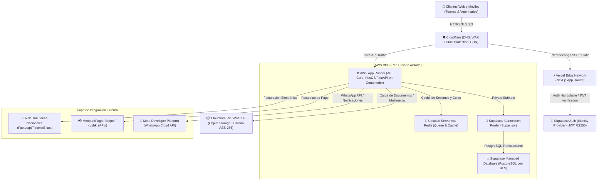
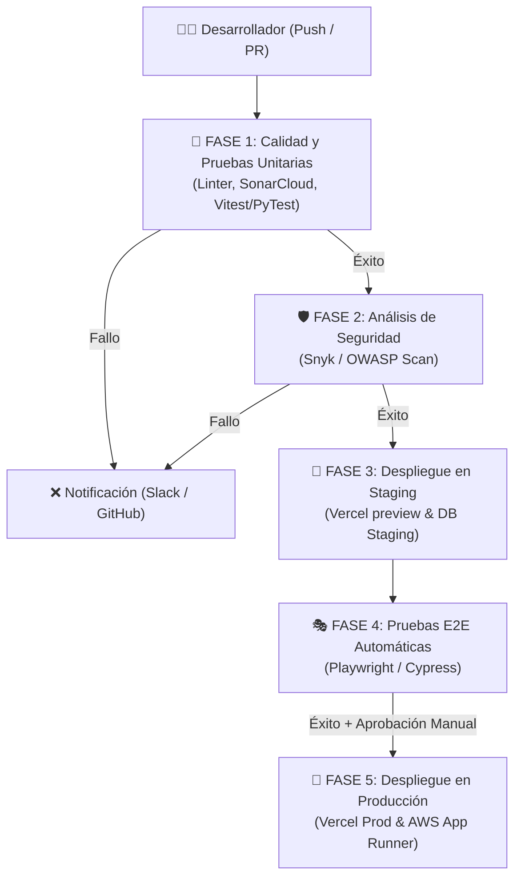

# DISEÑO DE INFRAESTRUCTURA CLOUD, CI/CD Y ESTRATEGIA FINOPS
**VetFlow SaaS: Gestión Veterinaria Multi-Tenant para Latinoamérica**  
**Versión:** 1.0.0  
**Fecha:** 16 de Julio de 2026  
**Autor:** Enterprise Cloud Architect  

---

## 1. RESUMEN EJECUTIVO Y FILOSOFÍA DE INFRAESTRUCTURA

El presente documento detalla la topología de nube, la estrategia de entornos, la automatización de despliegue (CI/CD) y el análisis financiero (FinOps) para **VetFlow SaaS**. 

La arquitectura de infraestructura está diseñada bajo el principio de **eficiencia y rentabilidad sin sobreingeniería** (Anti-Overengineering). En lugar de implementar clústeres auto-gestionados complejos y costosos desde el día uno (como Kubernetes en instancias bare-metal o VMs crudas con balanceadores de carga manuales), se adopta un enfoque híbrido **Serverless y Platform-as-a-Service (PaaS)**. 

### 1.1. Pilares del Diseño
*   **Aislamiento Lógico Estricto (Multi-Tenant Isolation):** Mediante PostgreSQL Row Level Security (RLS) en bases de datos gestionadas, impidiendo accesos no autorizados a nivel de motor SQL.
*   **Time-to-Market y Baja Fricción Operativa:** Uso de plataformas administradas (Next.js en Vercel Edge, AWS App Runner/Fargate, y Supabase Database) para que el equipo de desarrollo se enfoque en el software y no en la administración de servidores.
*   **Costes Lineales Optimizados (FinOps):** Elección de almacenamiento sin tarifas de transferencia de salida (egress fees) y escalabilidad automática orientada a eventos para mantener un margen bruto de infraestructura superior al 95%.
*   **Cumplimiento Normativo Local (LATAM):** Encriptación AES-256 en reposo, TLS 1.3 en tránsito y cifrado a nivel de columna para datos sensibles del tutor.

---

## 2. TOPOLOGÍA DE RED Y SERVICIOS CLOUD

La arquitectura técnica se distribuye en servicios administrados interconectados que aíslan el procesamiento del cliente (Edge), el cómputo del backend (Core API), el almacenamiento transaccional (PostgreSQL) y el almacenamiento multimedia (Object Storage).

### 2.1. Diagrama de Arquitectura de Red (Topología Cloud)

### 2.2. Justificación Técnica de Servicios Seleccionados

1.  **Frontend: Next.js en Vercel (Edge Platform)**
    *   *Justificación:* Vercel provee compilación y distribución en el Edge de manera nativa. El App Router de Next.js se beneficia de Server-Side Rendering (SSR) dinámico para agilizar la carga del historial clínico (EMR) y la agenda, disminuyendo la latencia percibida por el veterinario.
2.  **Backend Core: AWS App Runner**
    *   *Justificación:* AWS App Runner es un servicio PaaS que despliega aplicaciones en contenedores Docker directamente desde un repositorio de código o registro de contenedores (ECR). Administra de forma nativa el balanceo de carga, certificados TLS, y escalado automático sin la complejidad de configurar VPCs complejas, redes redundantes, o clústeres ECS/Fargate manualmente.
3.  **Base de Datos: Supabase Managed Database (PostgreSQL)**
    *   *Justificación:* Supabase ofrece una base de datos PostgreSQL de nivel Enterprise completamente gestionada, que incluye soporte nativo y simplificado para **Row Level Security (RLS)** y autenticación integrada. PostgreSQL es el estándar de facto para sistemas relacionales con requerimientos transaccionales complejos como cajas registradoras e inventarios FEFO.
4.  **Caché y Colas: Upstash Serverless Redis**
    *   *Justificación:* Evita configurar instancias EC2 dedicadas o clústeres de Redis que cobran por hora activa. Upstash cobra estrictamente por comando ejecutado, lo cual es óptimo para la escala inicial del proyecto, y se integra de forma transparente con frameworks de colas como BullMQ (Node.js) o Celery (Python) para enviar notificaciones asíncronas de WhatsApp sin degradar el rendimiento del core del backend.
5.  **Almacenamiento Multimedia: Cloudflare R2**
    *   *Justificación:* Las radiografías, ecografías y fotos médicas ocupan gigabytes de datos. AWS S3 cobra tarifas elevadas por transferencia de salida (Data Transfer Out / Egress Fees) cuando los veterinarios descargan estos archivos pesados. Cloudflare R2 ofrece almacenamiento compatible con la API de S3 con **$0 egress fees**, lo cual mitiga el riesgo de costes descontrolados en el plan Pro y Enterprise.

---

## 3. ESTRATEGIA DE ENTORNOS

Para garantizar la estabilidad del software y evitar fallos que afecten la operación diaria de las clínicas, se establecen tres entornos de desarrollo y ejecución aislados de manera lógica y física.

| Característica | Entorno de Desarrollo (Dev) | Entorno de Pruebas (Staging) | Entorno de Producción (Prod) |
| :--- | :--- | :--- | :--- |
| **Propósito** | Pruebas unitarias de desarrolladores. | Pruebas de integración, QA y validación del cliente. | Operación real de clínicas y tutores. |
| **Infraestructura** | Local (Docker Compose) + Supabase CLI Local. | PaaS Compartido (Vercel Preview Branches, Supabase staging tier). | Infraestructura dedicada con alta disponibilidad y escalado. |
| **Base de Datos** | PostgreSQL local efímero. | Copia sanitizada y anonimizada de producción. | Base de datos de alta disponibilidad (Multi-AZ) con RLS estricto. |
| **Rama de Git** | `feature/*`, `bugfix/*` | `main` / `staging` | `production` |
| **Aislamiento** | Totalmente local y offline. | Cuenta cloud aislada o proyecto separado. | VPC aislada, restricciones IAM estrictas. |

### 3.1. Flujo de Promoción de Cambios
1.  El desarrollador implementa en su entorno local con una base de datos local replicando el esquema de producción usando migraciones automáticas.
2.  Al crear un Pull Request (PR) hacia la rama `staging`, se despliega un entorno efímero en Vercel (Preview Deployment) y se ejecutan pruebas automáticas contra la base de datos de Staging.
3.  Una vez aprobado el PR y fusionado con `staging`, se ejecutan pruebas de integración E2E automatizadas.
4.  Para pasar a producción, se realiza un Release a la rama `production`. La infraestructura aplica las nuevas migraciones de base de datos de manera secuencial y ejecuta un despliegue "Zero-Downtime" (Blue-Green o Rolling Update) controlado por AWS App Runner y Vercel.

---

## 4. ESTRATEGIA DE CI/CD (GitHub Actions)

El ciclo de desarrollo y despliegue se automatiza mediante GitHub Actions, garantizando calidad del código, seguridad y despliegues sin intervención manual directa en los servidores de producción.

### 4.1. Configuración del Pipeline de Integración Continuo (CI)
Para cada PR, se ejecutan en paralelo:
*   **Linter & Formatter:** ESLint/Prettier (Node.js) o Ruff/Black (Python) para mantener la consistencia del código.
*   **Security Scanning (DevSecOps):** Snyk para detectar dependencias vulnerables y GitGuardian para verificar que no existan secretos (API Keys, contraseñas) expuestos en el código.
*   **Tests Unitarios:** Cobertura mínima del 80% requerida en lógica de negocio (especialmente en el vademécum, cálculo de caja FEFO e inmutabilidad del EMR).

### 4.2. Configuración del Pipeline de Despliegue Continuo (CD)
*   **Despliegue de Base de Datos:** Las migraciones de base de datos se aplican de forma automática antes del despliegue del backend. El backend cuenta con compatibilidad hacia atrás (backward compatibility) para que las consultas no fallen durante los segundos de transición de la base de datos.
*   **Despliegue Backend:** Construcción de la imagen Docker y subida al registro AWS ECR. AWS App Runner detecta la nueva imagen y realiza un despliegue tipo *Rolling Update* (mantiene activas las instancias viejas hasta que las nuevas superen los *Health Checks* de red).

---

## 5. ALTA DISPONIBILIDAD, RESPALDOS Y DISASTER RECOVERY (SLA & DR)

Para cumplir con el **SLA de disponibilidad del 99.9%** mensual y las métricas de resiliencia especificadas, se implementan controles redundantes en las capas de base de datos, almacenamiento e infraestructura de red.

### 5.1. Alta Disponibilidad (High Availability)
*   **Capa Edge/Frontend:** Vercel distribuye la aplicación estática y de renderizado a nivel global en su CDN. Si un nodo regional falla, el tráfico se redirige automáticamente al nodo más cercano.
*   **Capa Cómputo (Backend):** AWS App Runner distribuye las instancias del backend en múltiples zonas de disponibilidad (Multi-AZ) dentro de la región seleccionada (ej. `us-east-1` - Virginia, óptima para latencias en LATAM).
*   **Capa Base de Datos:** Supabase opera sobre instancias de base de datos con réplicas de lectura secundarias y balanceadores automáticos de conexión.

### 5.2. Estrategia de Backups
*   **Base de Datos Transaccional:** Se habilita la funcionalidad **Point-in-Time Recovery (PITR)** de Supabase, que realiza capturas del WAL (Write-Ahead Log) cada 15 minutos en almacenamiento redundante. Esto garantiza cumplir con el **RPO de 15 minutos** (pérdida máxima de datos admisible).
*   **Respaldo Frío Adicional:** Un cronjob diario automatizado extrae un volcado físico comprimido (`pg_dump`) de la base de datos de producción, lo cifra utilizando llaves AES-256 administradas en AWS KMS, y lo almacena en un bucket de AWS S3 ubicado en una región diferente (ej. `us-west-2` - Oregón) con política de retención inmutable (Object Lock) de 90 días para evitar ataques de ransomware.
*   **Almacenamiento Multimedia:** Cloudflare R2 replica los objetos de forma nativa e interna en múltiples servidores de datos de la región.

### 5.3. Recuperación ante Desastres (Disaster Recovery - DR)
En caso de una caída catastrófica de toda la infraestructura de la región cloud principal (ej. corte de energía masivo en Virginia de AWS):
*   **RTO (Recovery Time Objective): < 2 horas.**
*   **Procedimiento de Recuperación:**
    1.  **Redirección de DNS:** El WAF de Cloudflare redirige el tráfico hacia la región secundaria.
    2.  **Despliegue Automatizado:** El pipeline de GitHub Actions despliega el backend en la región secundaria (`us-west-2`) utilizando variables de entorno de respaldo.
    3.  **Restauración de Base de Datos:** Se levanta una instancia PostgreSQL en la región secundaria partiendo del último volcado diario inmutable de S3 y se aplican los logs incrementales (WAL) respaldados para recuperar la consistencia de los datos.

---

## 6. ANÁLISIS DE COSTES CLOUD (FINOPS) Y ESCALABILIDAD

A continuación se presenta el análisis de costes proyectado para las tres fases de crecimiento de VetFlow SaaS. Este análisis demuestra la rentabilidad del modelo SaaS basándose en los planes definidos (**Starter: $29/mes, Pro: $79/mes, Enterprise: $249/mes**) y un mix comercial esperado del **60% Starter, 30% Pro y 10% Enterprise**.

### 6.1. Supuestos de Carga y Métricas por Clínica

Para calcular con precisión el consumo de recursos, establecemos las métricas de uso estimadas por tipo de plan:

| Métrica de Uso (por clínica/mes) | Starter | Pro | Enterprise |
| :--- | :--- | :--- | :--- |
| **Transacciones / Registros EMR** | 450 | 1,800 | 6,000 |
| **Archivos Multimedia Subidos (Storage)** | 0 GB | 1.5 GB | 15 GB |
| **Solicitudes API (Requests)** | 30,000 | 150,000 | 600,000 |
| **Comandos de Caché/Cola (Redis)** | 10,000 | 50,000 | 200,000 |
| **Mensajes WhatsApp Notificaciones** | 0 (Solo Email) | 3,000 | 12,000 |

---

### 6.2. Escenario A: Startup Inicial (100 Clínicas Activas)
*   **Mix de Inquilinos:** 60 Starter, 30 Pro, 10 Enterprise.
*   **Volumen de Datos Base de Datos (DB):** ~8 GB netos al año.
*   **Volumen de Almacenamiento Multimedia:** ~200 GB nuevos al mes.
*   **Solicitudes API Totales/Mes:** 12.3 millones de peticiones.

#### Desglose de Costes Cloud Mensuales (USD)
1.  **Frontend (Vercel Pro):** $40 (2 licencias de desarrollador, sin cargos por excedente de ancho de banda).
2.  **Backend (AWS App Runner):** $80 (2 instancias base de 1 vCPU / 2GB RAM con auto-escalado a mínimo 1 instancia en horas de nulo uso).
3.  **Base de Datos (Supabase Pro Plan + Storage Addon):** $30 ($25 base + $5 por almacenamiento de base de datos extra).
4.  **Almacenamiento Multimedia (Cloudflare R2):** $3 (200 GB a $0.015/GB, $0 egress fees).
5.  **Caché y Colas (Upstash Serverless Redis):** $6 (30 millones de comandos a $0.20/millón).
6.  **Seguridad y CDN (Cloudflare Pro):** $20 (1 dominio con WAF y caching).
7.  **Monitoreo y Logs (Sentry + Axiom):** $50 (Planes iniciales de monitoreo de errores y trazabilidad).

*   **COSTO MENSUAL TOTAL INFRAESTRUCTURA (100 Clínicas): $229.00 USD**
*   **Costo Promedio por Clínica:** $2.29 USD/mes.

#### Análisis de Ingresos vs. Margen
*   **MRR Proyectado:** (60 * $29) + (30 * $79) + (10 * $249) = **$6,600.00 USD/mes**
*   **Margen Bruto de Infraestructura:** **96.53%**

---

### 6.3. Escenario B: Escala Media (1,000 Clínicas Activas)
*   **Mix de Inquilinos:** 600 Starter, 300 Pro, 100 Enterprise.
*   **Volumen de Datos Base de Datos (DB):** ~100 GB.
*   **Volumen de Almacenamiento Multimedia:** ~2.0 TB al mes.
*   **Solicitudes API Totales/Mes:** 123 millones de peticiones.

#### Desglose de Costes Cloud Mensuales (USD)
1.  **Frontend (Vercel Pro + Addons):** $150 (Addons de ancho de banda y Edge Functions).
2.  **Backend (AWS App Runner):** $400 (Escalado horizontal dinámico, de 2 a 8 instancias de 1 vCPU / 2GB RAM para soportar picos).
3.  **Base de Datos (Supabase Team/Enterprise Plan):** $400 (Cómputo dedicado de 4 Core / 16GB RAM para soportar las conexiones transaccionales concurrentes mediante Supavisor).
4.  **Almacenamiento Multimedia (Cloudflare R2):** $360 (24 TB acumulados históricos de imágenes médicas).
5.  **Caché y Colas (Upstash Redis):** $60 (300 millones de comandos).
6.  **Seguridad y CDN (Cloudflare Business):** $200 (WAF avanzado, reglas personalizadas y mitigación avanzada de DDoS).
7.  **Monitoreo y Logs (Sentry + Axiom):** $300 (Volumen intermedio de telemetría y logs estructurados).

*   **COSTO MENSUAL TOTAL INFRAESTRUCTURA (1,000 Clínicas): $1,870.00 USD**
*   **Costo Promedio por Clínica:** $1.87 USD/mes.

#### Análisis de Ingresos vs. Margen
*   **MRR Proyectado:** (600 * $29) + (300 * $79) + (100 * $249) = **$66,000.00 USD/mes**
*   **Margen Bruto de Infraestructura:** **97.17%**

---

### 6.4. Escenario C: Alta Escala Enterprise (5,000 Clínicas Activas)
*   **Mix de Inquilinos:** 3,000 Starter, 1,500 Pro, 500 Enterprise.
*   **Volumen de Datos Base de Datos (DB):** ~500 GB (PostgreSQL optimizado e indexado, con archivado histórico de auditorías).
*   **Volumen de Almacenamiento Multimedia:** ~120 TB acumulados históricos.
*   **Solicitudes API Totales/Mes:** 615 millones de peticiones.

#### Desglose de Costes Cloud Mensuales (USD)
1.  **Frontend (Vercel Enterprise):** $1,000 (SLA empresarial, bypass de límites y seguridad dedicada Vercel Shield).
2.  **Backend (AWS App Runner o ECS Fargate):** $2,000 (Multi-región o escalamiento de hasta 20 instancias concurrentes).
3.  **Base de Datos (AWS RDS Aurora PostgreSQL Serverless v2 Multi-AZ):** $1,800 (Migración a RDS Aurora para capacidades empresariales avanzadas de escalabilidad automática de ACUs y redundancia geográfica instantánea).
4.  **Almacenamiento Multimedia (Cloudflare R2 con Lifecycle Policies):** $1,800 (120 TB optimizados, moviendo archivos históricos de más de 1 año a almacenamiento de frío/archivo compatible).
5.  **Caché y Colas (Upstash Redis / Redis Enterprise):** $300 (1.5 mil millones de comandos mensuales).
6.  **Seguridad y CDN (Cloudflare Enterprise):** $1,000 (Protección empresarial completa, DNS balanceado e IP dedicada).
7.  **Monitoreo y Logs (Datadog / Axiom Enterprise):** $1,200 (Telemetría completa de APM, alertas en tiempo real y logs estructurados agregados).

*   **COSTO MENSUAL TOTAL INFRAESTRUCTURA (5,000 Clínicas): $9,100.00 USD**
*   **Costo Promedio por Clínica:** $1.82 USD/mes.

#### Análisis de Ingresos vs. Margen
*   **MRR Proyectado:** (3,000 * $29) + (1,500 * $79) + (500 * $249) = **$330,000.00 USD/mes**
*   **Margen Bruto de Infraestructura:** **97.24%**

---

### 6.5. Tabla Comparativa de Crecimiento y FinOps

| Métrica / Escala | 100 Clínicas | 1,000 Clínicas | 5,000 Clínicas |
| :--- | :---: | :---: | :---: |
| **Ingreso Mensual (MRR)** | $6,600.00 USD | $66,000.00 USD | $330,000.00 USD |
| **Costo de Infraestructura** | $229.00 USD | $1,870.00 USD | $9,100.00 USD |
| **Costo por Clínica Promedio**| $2.29 USD | $1.87 USD | $1.82 USD |
| **Margen Bruto de Redes/Cloud**| **96.53%** | **97.17%** | **97.24%** |
| **Eficiencia Operativa** | Alta (PaaS/Serverless)| Muy Alta (PaaS Dedicado)| Máxima (Enterprise/Aurora)|

---

## 7. GATES DE CALIDAD DE INFRAESTRUCTURA (Quality Gates)

Para validar el diseño, respondemos obligatoriamente a los criterios de calidad de arquitectura de nube:

1.  **¿La infraestructura soporta millones de usuarios concurrentes de forma elástica?**
    *   *Sí.* La combinación de la distribución en el Edge de Vercel para el frontend y el auto-escalado horizontal de AWS App Runner para el backend asegura que el sistema pueda digerir ráfagas masivas de tráfico. Supabase (y en fases posteriores AWS RDS Aurora Serverless) escala el cómputo de base de datos de manera proporcional a las transacciones concurrentes.
2.  **¿Existe algún punto único de fallo (SPOF) en la arquitectura?**
    *   *No.* Todos los componentes críticos cuentan con alta disponibilidad de manera nativa: Vercel está distribuido globalmente, AWS App Runner opera de forma Multi-AZ, y las bases de datos transaccionales cuentan con replicación y PITR en tiempo real.
3.  **¿La arquitectura cuenta con alta disponibilidad configurada?**
    *   *Sí.* Se ha detallado la redundancia Multi-AZ en cómputo y bases de datos, además de CDN global en la capa de frontend.
4.  **¿Los costes estimados están optimizados al mínimo viable para la fase actual del proyecto?**
    *   *Sí.* Para 100 clínicas el coste es de solo $229 USD mensuales, lo cual es perfectamente financiable con las primeras 4-5 suscripciones cobradas. Se evita la sobreingeniería de Kubernetes y se aprovechan herramientas serverless (Upstash Redis, Cloudflare R2 sin tarifas de salida) para optimizar el coste total de propiedad (TCO).
5.  **¿Las latencias y el uso de CDN son los adecuados?**
    *   *Sí.* Next.js en el Edge y Cloudflare CDN garantizan latencias menores a 100ms para activos estáticos. La base de datos y el backend se alojan en la región con mejores conexiones de red hacia Latinoamérica (us-east-1).
6.  **¿El sistema soporta un plan de recuperación ante desastres y copias de seguridad suficientes?**
    *   *Sí.* Se define un RPO de 15 minutos (a través de PITR) y un RTO menor a 2 horas, respaldado por volcados inmutables diarios en regiones geográficas secundarias y procedimientos automatizados de despliegue IaC.
7.  **¿La infraestructura se puede migrar fácilmente entre proveedores de nube?**
    *   *Sí.* Al utilizar contenedores estándar Docker para el backend y PostgreSQL estándar para la base de datos, el sistema puede ser portado fácilmente a Google Cloud (Cloud Run + Cloud SQL) o Microsoft Azure (Container Apps + Azure Database for PostgreSQL) si es requerido en el futuro, minimizando el vendor lock-in técnico.
8.  **¿Se ha evitado la sobreingeniería y se garantiza mantenibilidad para los próximos diez años?**
    *   *Sí.* La arquitectura se basa en estándares del mercado (Next.js, Docker, Postgres, Redis) y escala desde un stack puramente gestionado/Serverless de bajo coste hasta soluciones de alta capacidad en AWS sin requerir cambios de paradigma en el código base.
