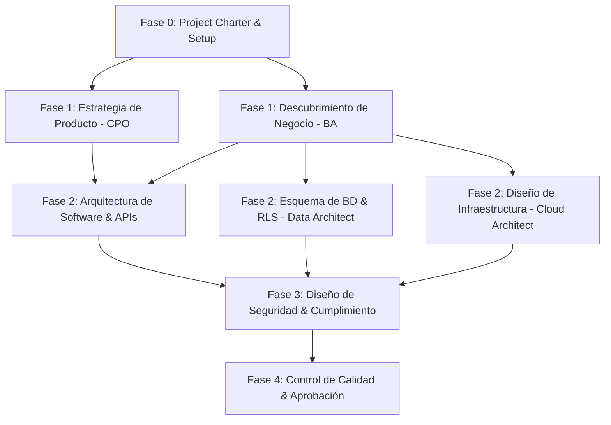

# PROJECT CHARTER: VetFlow SaaS

## 1. OBJETIVO DEL NEGOCIO Y DOMINIO
*   **Problema a resolver:** Ineficiencia operativa en clínicas veterinarias de Latinoamérica debido al uso de herramientas fragmentadas, procesos manuales en el historial clínico (EMR) y falta de control centralizado sobre citas, inventarios y finanzas multi-sucursal.
*   **Dominio del Negocio:** HealthTech / SaaS Multi-Tenant Veterinario.
*   **Tipo de Aplicación:** Plataforma Web SaaS (Next.js en Frontend, REST/GraphQL API en Backend).

## 2. ESTRATEGIA TÉCNICA Y ARQUITECTURA
*   **Arquitectura propuesta:** Monolito Modular con principios de Clean Architecture dentro de cada módulo, permitiendo un desacoplamiento claro y la posibilidad de migrar módulos a microservicios en el futuro si la carga lo requiere.
*   **Stack Tecnológico:**
    *   **Frontend:** Next.js (App Router), React, Tailwind CSS, Shadcn/ui.
    *   **Backend:** Node.js (NestJS) o Python (FastAPI).
    *   **Base de datos:** PostgreSQL con RLS (Row Level Security) para aislamiento estricto de inquilinos (Tenants).
    *   **Autenticación:** Auth0 / Supabase Auth / Clerk con soporte multi-tenant y RBAC (Role-Based Access Control).

## 3. MAPA DE DEPENDENCIAS Y PARALELIZACIÓN (Critical Path Map)

*   **Tareas Paralelas:** 
    *   `Product Strategy Master` (CPO) y `Enterprise Business Analyst` (BA) trabajan simultáneamente en la definición conceptual del negocio.
    *   Los arquitectos de software, datos y nube diseñan sus componentes en paralelo una vez fijados los requerimientos de negocio.
*   **Ruta Crítica:** Requerimientos de Negocio -> Arquitectura del Sistema -> Diseño del Esquema de Datos -> Modelo de Seguridad -> Aprobación de la Fase.

## 4. REGISTRO DE RIESGOS VIVO (Live Risk Register)
| ID | Descripción del Riesgo | Prob. (1-5) | Imp. (1-5) | Prioridad | Plan de Mitigación | Responsable | Estado |
| :--- | :--- | :---: | :---: | :---: | :--- | :--- | :--- |
| R-01 | Aislamiento de datos deficiente en multi-tenant | 2 | 5 | CRÍTICO | Implementar Row Level Security (RLS) a nivel de base de datos en todas las tablas sensibles. | Enterprise Data Architect | Abierto |
| R-02 | Sobrecarga de features en MVP (Feature Creep) | 4 | 3 | ALTO | Aplicar de forma estricta el marco MoSCoW y la rúbrica RICE para descartar tareas fuera del MVP. | Product Strategy Master | Abierto |
| R-03 | Complejidad fiscal multi-país en LATAM | 3 | 4 | ALTO | Abstraer las pasarelas de pago y facturación mediante adaptadores de interfaz, sin codificar reglas locales en el core. | CTO Architect | Abierto |
| R-04 | Incumplimiento de regulaciones de recetas médicas | 2 | 4 | MEDIO | Diseñar un módulo de firma y recetas parametrizable según los requerimientos locales de cada país. | Enterprise Compliance Expert | Abierto |

## 5. SKILLS GLOBALES SELECCIONADOS Y ACTIVOS
*   [x] Project Orchestrator (Cerebro & CTO)
*   [x] Product Strategy Master (CPO)
*   [x] Enterprise Business Analyst (BA Master)
*   [x] CTO Architect
*   [x] Architecture Master
*   [x] Enterprise Data Architect
*   [x] Enterprise Cloud Architect
*   [x] Security Expert
*   [x] Enterprise Compliance Expert
