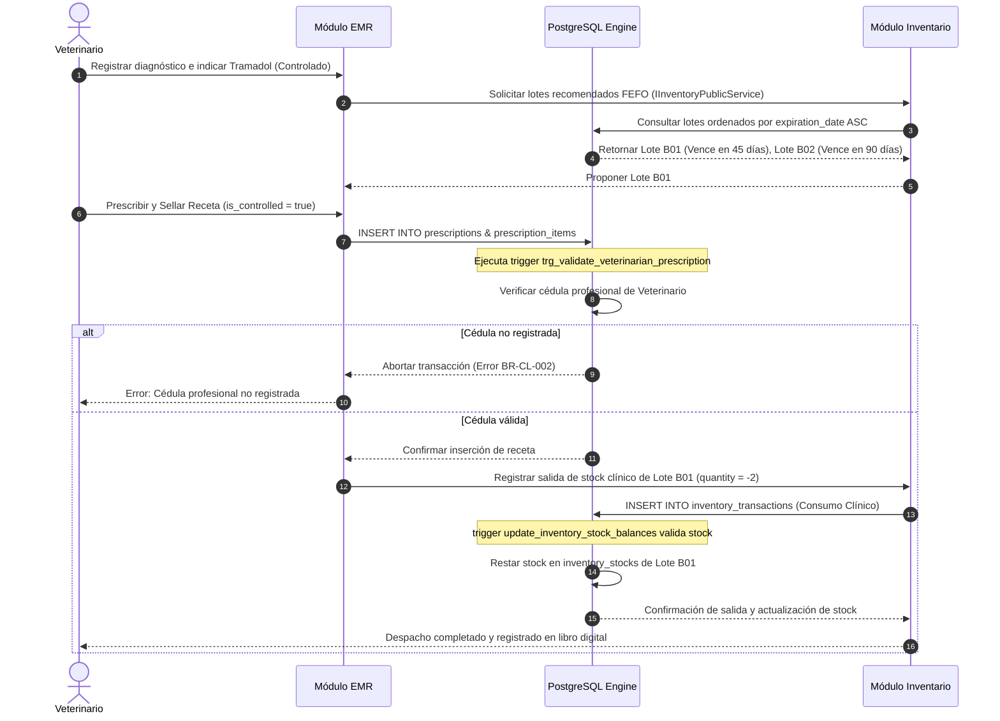
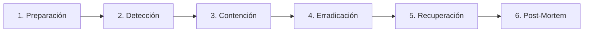

# ESTRATEGIA DE SEGURIDAD Y CUMPLIMIENTO NORMATIVO: VetFlow SaaS
**Versión:** 1.0.0  
**Fecha:** 16 de Julio de 2026  
**Autor:** Security & Compliance Expert (Enterprise Security Expert & Enterprise Compliance Master)  
**Estado:** Propuesta de Diseño Técnico y Estratégico (Para Aprobación de Arquitectura y Dirección)

---

## 1. INTRODUCCIÓN Y MARCO ESTRATÉGICO DE SEGURIDAD

**VetFlow SaaS** procesa información crítica transaccional, clínica y de datos personales de tutores y mascotas en Latinoamérica. La convergencia de datos médicos veterinarios (PHI), datos de identificación personal de los propietarios (PII), cobros e inventarios de estupefacientes (medicamentos controlados) exige un enfoque sistemático de fortificación.

### 1.1. Principios Rectores de Seguridad (Security Principles)
1.  **Seguridad por Diseño (Security by Design):** La seguridad no es una capa posterior; está integrada en las fases de diseño de software e infraestructura (ej. Row Level Security en la capa de persistencia).
2.  **Confianza Cero (Zero Trust Architecture):** Ningún actor, dispositivo o servicio dentro o fuera de la red privada es confiable por defecto. Se requiere validación de identidad y permisos en cada punto de interacción.
3.  **Menor Privilegio (Least Privilege):** Cada usuario, servicio o rol de base de datos opera únicamente con el conjunto mínimo de permisos necesarios para realizar sus tareas (SoD - Segregación de Funciones).
4.  **Defensa en Profundidad (Defense in Depth):** Implementación de controles redundantes de seguridad en múltiples capas (Edge/WAF, Red VPC, Cómputo API, Criptografía de Datos y Motor de Base de Datos).
5.  **Cumplimiento Proactivo:** Diseñar sistemas alineados con leyes de protección de datos locales (México, Colombia, Chile, Brasil) y regulaciones sanitarias veterinarias para evitar riesgos legales o penalizaciones fiscales.

---

## 2. MODELADO DE AMENAZAS MEDIANTE EL MARCO STRIDE

Para evaluar sistemáticamente los riesgos de VetFlow SaaS, analizamos los dos puntos más sensibles del diseño:
*   **Base de datos multi-tenant compartida con Row Level Security (RLS)**.
*   **Comunicación de APIs, Gateways y flujo de integraciones externas**.

### 2.1. Diagrama de Flujo de Datos (DFD) y Límites de Confianza
El siguiente diagrama detalla cómo fluyen los datos y dónde se cruzan los límites de confianza (Trust Boundaries) de la aplicación.

```mermaid
graph TD
    subgraph Zona Publica (Sin Confianza)
        TutorClient["📱 App Tutor (Mobile/Web)"]
        VetClient["💻 App Clinica (Veterinarios/Recepcion)"]
    end

    subgraph Limite de Confianza - API Gateway
        Cloudflare["🛡️ CDN / Cloudflare WAF"]
    end

    subgraph Zona Core SaaS (Confianza Media/Alta)
        API["⚙️ AWS App Runner (API Core Node/Python)"]
        SupabaseAuth["🔑 Supabase Auth (IdP - JWT RS256)"]
        Cache["🔴 Upstash Redis (Colas/Sesiones)"]
    end

    subgraph Limite de Confianza - Base de Datos
        DBPool["🔌 Connection Pooler (Supavisor)"]
    end

    subgraph Zona de Datos Protegida (Confianza Critica)
        PostgresDB["🗄️ PostgreSQL Engine con RLS"]
        R2["📦 Cloudflare R2 (Object Storage - Cifrado)"]
    end

    subgraph Integraciones Externas
        WhatsApp["💬 API WhatsApp Cloud"]
        SAT["🧾 DIAN / SAT (Facturacion Local)"]
        Payments["💳 MercadoPago / Kushki"]
    end

    TutorClient & VetClient -->|HTTPS / TLS 1.3| Cloudflare
    Cloudflare -->|Trafico Filtrado| API
    API -->|Validacion RS256| SupabaseAuth
    API -->|Comandos y Colas| Cache
    API -->|SET LOCAL app.current_tenant_id + SQL| DBPool
    DBPool -->|Políticas RLS Aplicadas| PostgresDB
    API -->|Upload / Download| R2
    API -->|Consumo REST/Webhooks| WhatsApp & SAT & Payments
```

---

### 2.2. Matriz de Amenazas STRIDE y Mitigaciones

| Categoría STRIDE | Amenaza Identificada | Vector de Ataque en VetFlow | Impacto (C, I, D) | Mitigación y Salvaguarda Tecnológica |
| :--- | :--- | :--- | :--- | :--- |
| **S**poofing *(Suplantación)* | Suplantación de identidad de un veterinario o administrador. | Un atacante intercepta o roba un JWT o refresh token por secuestro de sesión (Session Hijacking) y realiza recetas de medicamentos controlados. | **Confidencialidad / Integridad** | 1. Implementación de **Refresh Token Rotation (RTR)** almacenado en cookies HTTP-only, Secure y SameSite=Strict.<br>2. Expiración de Access Token corta (15 minutos).<br>3. Autenticación de doble factor (MFA) obligatoria para cuentas con roles de `DirectorClinico` y `TenantOwner`. |
| **T**ampering *(Alteración)* | Modificación no autorizada de registros históricos en el EMR o inventarios. | Un veterinario intenta modificar un diagnóstico tras una mala praxis, o un farmacéutico altera el stock físico de anestésicos. | **Integridad** | 1. Trigger PostgreSQL inmutable (`trg_clinical_record_immutability`) que bloquea `UPDATE` si el estado es 'Cerrado' (BR-CL-001).<br>2. Firma hash (SHA-256) de los anexos del EMR encadenando el hash del registro anterior (tipo blockchain) en la base de datos.<br>3. Ajustes de stock negativo requieren firma digital de `DirectorClinico` e ingreso justificado de texto descriptivo (BR-INV-004). |
| **R**epudiation *(Repudio)* | Un veterinario emisor de recetas niega haber prescrito un estupefaciente. | Manipulación de recetas sin registro de autoría médica o borrado manual de logs de transacciones. | **Integridad / Auditoría** | 1. Trigger `trg_validate_veterinarian_prescription` que valida la cédula profesional del veterinario al insertar una receta (BR-CL-002).<br>2. Logs de auditoría inmutables almacenados fuera de la base de datos operacional (Cloudflare R2 con Object Lock / Write Once Read Many). |
| **I**nformation Disclosure *(Divulgación)* | Fuga de datos de contacto (PII) o historiales clínicos de mascotas (PHI). | Un desarrollador comete un error en una consulta SQL o inyecta código, exponiendo datos de un Tenant B a usuarios del Tenant A (Fuga de RLS). | **Confidencialidad** | 1. Implementación de **Row Level Security (RLS)** obligatorio en todas las tablas transaccionales de PostgreSQL, forzado para el owner (`FORCE ROW LEVEL SECURITY`).<br>2. Inyección de la variable de sesión `SET LOCAL app.current_tenant_id` en el adaptador transaccional.<br>3. Cifrado a nivel de columna con la extensión `pgcrypto` para PII crítica (`email`, `phone`, `address`). |
| **D**enial of Service *(DoS)* | Indisponibilidad de la agenda o del historial clínico electrónico. | Un bot realiza ataques de fuerza bruta al login o inundación de peticiones (DDoS) al API de citas clínicas. | **Disponibilidad** | 1. Protección de red en el Edge con **Cloudflare WAF** para mitigación de DDoS y filtrado geográfico (Geo-Blocking para países fuera de LATAM).<br>2. Rate Limiter dinámico en API Gateway: 100 peticiones/min para endpoints generales, 5 peticiones/min para Login/Reset por IP. |
| **E**levation of Privilege *(Elevación)* | Un recepcionista o farmacéutico accede a dashboards financieros o cambia roles. | Un usuario manipula el payload del token JWT local o realiza Inyección de Parámetros en endpoints REST de cambio de rol. | **Confidencialidad / Integridad** | 1. Firma asimétrica de tokens JWT con **RS256** mediante Supabase Auth / IdP confiable.<br>2. Middlewares de RBAC en backend con verificación estricta de scopes y permisos en cada endpoint.<br>3. La base de datos opera con rol restringido `app_user` (sin permisos DDL ni bypass RLS). Solo el rol `vetflow_superadmin` puede saltar RLS para procesos administrativos globales. |

---

## 3. POLÍTICA DE PROTECCIÓN Y CIFRADO DE DATOS (PII & PHI) EN LATAM

Para operar lícitamente en Latinoamérica, VetFlow SaaS debe estructurar un modelo de cumplimiento con regulaciones de privacidad digital rigurosas:
*   **México:** LFPDPPP (Ley Federal de Protección de Datos Personales en Posesión de los Particulares).
*   **Colombia:** Ley 1581 de 2012 (Régimen General de Protección de Datos Personales).
*   **Chile:** Ley 19.628 (Protección de la Vida Privada).
*   **Brasil:** LGPD (Lei Geral de Proteção de Dados).

### 3.1. Clasificación de Datos en VetFlow SaaS

```
+---------------------------------------------------------------------------------+
|                                Clasificación de Datos                           |
+------------------------------------+--------------------------------------------+
|  PII (Personally Identifiable Info)|  PHI (Protected Health Info - Animal)      |
|  - Nombre y apellido de tutores    |  - Ficha médica y diagnóstico del paciente |
|  - Correo electrónico de contacto  |  - Constantes vitales (T°, FC, Peso, FR)   |
|  - Teléfono internacional          |  - Hojas de monitoreo de hospitalización   |
|  - Dirección física de domicilio   |  - Imágenes médicas (Radiografías, Ecos)   |
|  - Documento tributario (RFC/RUT)  |  - Prescripción y recetas emitidas         |
+------------------------------------+--------------------------------------------+
```

### 3.2. Estrategia Criptográfica (Cifrado de Datos)
Para cumplir con los estándares Enterprise, la estrategia criptográfica se divide en tres dimensiones:

#### A. Cifrado en Tránsito
Todo canal de comunicación hacia o desde VetFlow SaaS se cifra bajo el protocolo **TLS 1.3** (compatibilidad mínima con TLS 1.2 para dispositivos de clínicas antiguas). Se implementa la cabecera HTTP **Strict-Transport-Security (HSTS)** para forzar la navegación por canal seguro:
```http
Strict-Transport-Security: max-age=63072000; includeSubDomains; preload
```

#### B. Cifrado en Reposo (Discos y Objetos)
*   **Bases de Datos:** La base de datos de producción gestionada por Supabase (AWS RDS) utiliza cifrado transparente de datos (TDE) mediante el algoritmo **AES-256** con claves rotadas automáticamente.
*   **Object Storage (Archivos multimedia):** Las radiografías, ecografías y PDF de consentimientos almacenados en Cloudflare R2 / AWS S3 se cifran en el servidor usando **SSE-S3 (AES-256)**.

#### C. Cifrado a Nivel de Columna (Column-Level Encryption)
Para cumplir rigurosamente con la Ley 1581 (Colombia) y LFPDPPP (México), las columnas sensibles de la tabla `tutors` (`email`, `phone`, `address`) deben ser indescifrables para atacantes que logren extraer un volcado físico de la base de datos.
*   **Implementación:** Se utiliza la extensión `pgcrypto` de PostgreSQL para cifrado simétrico en la base de datos o descifrado en el backend.
*   **Ejemplo Lógico de Almacenamiento (pgcrypto):**
    ```sql
    -- Inserción de tutor cifrando datos de contacto mediante AES-256
    INSERT INTO tutors (id, tenant_id, first_name, last_name, email, phone, secret_key_id)
    VALUES (
        'uuid-del-tutor',
        'uuid-del-tenant',
        'Juan',
        'Pérez',
        pgp_sym_encrypt('juan.perez@email.com', current_setting('app.encryption_key')),
        pgp_sym_encrypt('+525512345678', current_setting('app.encryption_key')),
        'key-id-aws-kms'
    );

    -- Consulta descifrando los campos únicamente si la clave de sesión está presente
    SELECT first_name, last_name,
           pgp_sym_decrypt(email, current_setting('app.encryption_key')) AS email,
           pgp_sym_decrypt(phone, current_setting('app.encryption_key')) AS phone
    FROM tutors
    WHERE id = 'uuid-del-tutor';
    ```
*   *Gestión de Claves:* Las claves criptográficas se almacenan de manera externa utilizando **AWS KMS** (Key Management Service) y se inyectan temporalmente en la sesión de base de datos (`SET LOCAL app.encryption_key = '...'`) durante la transacción del usuario autenticado.

---

### 3.3. Derechos ARCO (Acceso, Rectificación, Cancelación, Oposición) y Derecho al Olvido
Las normativas LATAM obligan a dar facilidades para la gestión de datos personales de tutores.

#### Flujo de Consentimiento
*   **Captura:** En la pantalla de recepción (check-in) o en el formulario digital de ingreso, se implementa una casilla obligatoria (Opt-in independiente) donde el tutor acepta explícitamente:
    *   *Uso Clínico:* Procesamiento de datos de su mascota para el EMR.
    *   *Notificaciones:* Envío de recordatorios de citas por WhatsApp/Email.
    *   *Marketing:* Ofertas e información de la clínica.
*   **Persistencia:** La aceptación se almacena en la base de datos con la IP, timestamp y versión de la política de privacidad firmada.

#### Mecanismos Técnicos para el Borrado y Anonimización (Derecho al Olvido)
Cuando un tutor exige la eliminación de sus datos, VetFlow SaaS aplica una **Anonimización Irreversible (Data Masking)** sobre la información PII para preservar la integridad de los datos financieros e históricos de medicamentos controlados (que por ley tributaria y veterinaria no pueden borrarse físicamente durante 5 a 10 años).

```
[Tutor exige Derecho al Olvido]
             |
             v
+----------------------------+      No      +------------------------------------------+
| ¿Tutor tiene recetas de    | ------------> | Borrado Físico (DELETE CASCADE)          |
| medicamentos controlados?  |               | de registros de Tutor e historial.       |
+----------------------------+               +------------------------------------------+
             | Sí
             v
+--------------------------------------------------------------------------------------+
| Anonimización Irreversible (SQL UPDATE Masking)                                      |
| - first_name  --> 'ANONIMO'                                                          |
| - last_name   --> 'TUTOR - [HASH-MD5]'                                               |
| - email       --> 'deleted-[uuid]@vetflow.com'                                        |
| - phone       --> '+0000000000'                                                      |
| - address     --> NULL                                                               |
| - tax_identif --> 'XAXX010101000' (RFC genérico / RUT genérico local)                |
| * El historial médico de la mascota y ventas se preservan por consistencia legal.   |
+--------------------------------------------------------------------------------------+
```

---

## 4. TRAZABILIDAD E INMUTABILIDAD DE MEDICAMENTOS CONTROLADOS

El almacenamiento, uso y dispensación de psicotrópicos, anestésicos y estupefacientes de uso veterinario (ej. Ketamina, Tramadol, Fenobarbital, Fentanilo) está regulado estrictamente por entidades estatales agropecuarias y sanitarias en LATAM:
*   **México:** SENASICA (Servicio Nacional de Sanidad, Inocuidad y Calidad Agroalimentaria) y COFEPRIS.
*   **Colombia:** ICA (Instituto Colombiano Agropecuario) y el Fondo Nacional de Estupefacientes.
*   **Chile:** SAG (Servicio Agrícola y Ganadero).
*   **Argentina/Perú:** SENASA (Servicio Nacional de Sanidad y Calidad Agroalimentaria).

Además, el egreso y cobro de estos ítems debe estar sincronizado tributariamente con las agencias fiscales locales (**SAT** en México, **DIAN** en Colombia) a través del puerto `BillingPort` mediante la facturación electrónica localizada.

### 4.1. Mecanismos Técnicos de Inmutabilidad en Base de Datos
Para blindar el sistema contra manipulaciones accidentales o malintencionadas del libro de medicamentos controlados, se implementan triggers a nivel de base de datos que validan las reglas de negocio críticas del sistema.

#### A. Validación de Cédula Profesional del Veterinario (BR-CL-002)
El trigger `trg_validate_veterinarian_prescription` impide la inserción de recetas con flag `is_controlled = true` si el profesional no tiene una matrícula registrada.
```sql
-- Trigger activo en Postgres para validación de receta controlada
CREATE OR REPLACE FUNCTION validate_controlled_prescription()
RETURNS TRIGGER AS $$
DECLARE
    v_license VARCHAR(100);
BEGIN
    SELECT professional_license INTO v_license
    FROM users
    WHERE id = NEW.veterinarian_id AND tenant_id = NEW.tenant_id;

    IF NEW.is_controlled = TRUE AND (v_license IS NULL OR TRIM(v_license) = '') THEN
        RAISE EXCEPTION 'Restricción Sanitaria (BR-CL-002): No se puede prescribir un estupefaciente/medicamento controlado sin registrar la cédula profesional en el perfil médico.'
            USING ERRCODE = 'check_violation';
    END IF;

    RETURN NEW;
END;
$$ LANGUAGE plpgsql;
```

#### B. Registro Inmutable de Movimientos de Inventario (Libro Digital Controlado)
La tabla `inventory_transactions` actúa como el **Libro Oficial de Medicamentos Controlados**.
*   **Inmutabilidad del Log:** Se prohíben por completo sentencias `UPDATE` y `DELETE` en la tabla `inventory_transactions` mediante un trigger incondicional:
```sql
CREATE OR REPLACE FUNCTION block_inventory_transaction_changes()
RETURNS TRIGGER AS $$
BEGIN
    RAISE EXCEPTION 'Auditoría de Seguridad: Los registros del libro de transacciones de inventario son inmutables. NUNCA pueden ser actualizados o eliminados.'
        USING ERRCODE = 'check_violation';
END;
$$ LANGUAGE plpgsql;

CREATE TRIGGER trg_block_inventory_changes
    BEFORE UPDATE OR DELETE ON inventory_transactions
    FOR EACH ROW
    EXECUTE FUNCTION block_inventory_transaction_changes();
```
*   **Consecuencia de Ajustes (Mermas):** Si existe una merma (ej. ruptura de ampolla de ketamina), se debe insertar una *nueva* fila con signo negativo (`quantity < 0`), indicando `transaction_type = 'Ajuste Merma'`, asociando el usuario que autoriza (rol `DirectorClinico`) y agregando una justificación escrita detallada de más de 15 caracteres (verificado por `trg_validate_inventory_adjustment` en BR-INV-004).

---

### 4.2. Flujo de Control de Medicamentos FEFO y Receta Médica



---

## 5. ESTRATEGIA DE AUDITORÍA Y CONTROL DE ACCESOS (RBAC/IAM)

Para prevenir el fraude y garantizar la rendición de cuentas, VetFlow SaaS estructura un sistema estricto de control de accesos e historial de auditorías.

### 5.1. Autenticación y Sesiones Seguras
*   **Identity Provider (IdP):** Supabase Auth / AWS Cognito.
*   **Mecanismo de Token:** JSON Web Token (JWT) firmado asimétricamente mediante **RS256** (llave privada en IdP, llave pública en el API backend para descifrado).
*   **Duración:**
    *   *Access Token:* 15 minutos (Payload contiene `tenant_id`, `user_id`, `role`, `branch_id`).
    *   *Refresh Token:* 7 días, con rotación obligatoria de token (RTR) en cada uso. Almacenado en cookies HTTP-only, Secure y SameSite=Strict.

### 5.2. Matriz de Control de Accesos por Rol (RBAC / Segregación de Funciones)

Establecemos la matriz granular de permisos para prevenir la elevación de privilegios:

| Tabla / Recurso | SuperAdmin (SaaS) | TenantOwner (Clínica) | DirectorClinico | Veterinario | Recepcionista | Farmaceutico |
| :--- | :---: | :---: | :---: | :---: | :---: | :---: |
| `tenants` *(Suscripciones)* | CRUD | R (Solo propio) | - | - | - | - |
| `branches` *(Sucursales)* | CRUD | CRUD | R | R | R | R |
| `users` *(Usuarios/Permisos)* | CRUD | CRUD | R | R | - | - |
| `tutors` & `pets` | R | CRUD | CRUD | CRUD | CRUD | R |
| `clinical_records` (EMR) | - | R | CRUD (Sellar) | CRUD (Sellar) | R (Solo lectura)| - |
| `clinical_annexes` (Notas) | - | R | C (Crear) | C (Crear) | R | - |
| `prescriptions` (Recetas) | - | R | C (Crear) | C (Crear) | R | R |
| `products` (Vademécum) | - | CRUD | CRUD | R | R | CRUD |
| `inventory_stocks` | R | R | R | R | R | CRUD |
| `inventory_transactions` | R | R | C (Ajustes) | - | - | C (Compras/Traslados)|
| `sales` & `payments` (Caja) | R | R (Dashboards)| - | - | CRUD | - |
| `cash_registers` (Arqueo) | R | R | R | - | C (Cierre Ciego) | - |

*Leyenda: **CRUD**: Crear, Leer, Actualizar, Borrar; **C**: Crear; **R**: Leer; **-**: Sin acceso.*

---

### 5.3. Estrategia de Registro de Auditoría (Audit Logging)
Todas las operaciones que alteren el estado clínico, inventario y cobros deben generar un log estructurado JSON de auditoría.

#### Estructura del Payload de Auditoría (Ejemplo JSON)
```json
{
  "event_id": "8ca65c92-3c22-4467-b5bf-ad2eeef7c162",
  "timestamp": "2026-07-16T17:34:10Z",
  "tenant_id": "366258be-039c-48c0-83cc-54655f412852",
  "branch_id": "4efd98ba-2a1c-4b67-9de2-98ba29ea391c",
  "actor": {
    "user_id": "90e2920c-c760-496a-8b83-b778732ba19e",
    "role": "Veterinario",
    "ip_address": "187.190.45.22",
    "user_agent": "Mozilla/5.0 (Windows NT 10.0; Win64; x64) AppleWebKit/537.36..."
  },
  "action": "CLINICAL_RECORD_SEAL",
  "resource": "clinical_records",
  "resource_id": "77ea293c-cf82-41ba-a1de-889efc11a00a",
  "metadata": {
    "patient_id": "22bf98aa-12ef-447b-ad4b-9eef22ba771a",
    "diagnosis": "Insuficiencia renal crónica",
    "prescription_number": "RX-MX-2026-9912"
  },
  "changes": {
    "before": { "status": "Abierto", "closed_at": null },
    "after": { "status": "Cerrado", "closed_at": "2026-07-16T17:34:10Z" }
  }
}
```

#### Arquitectura de Logs Inmutables
Para asegurar que un administrador malintencionado no borre los logs de auditoría para encubrir fraudes:
1.  **Transmisión:** La aplicación backend no escribe los logs de auditoría en la base de datos operacional. Los envía de forma asíncrona mediante streaming continuo a un concentrador de logs (**Axiom / Datadog** o **AWS Kinesis Firehose**).
2.  **Destino Final:** Los logs se depositan en un bucket de **Cloudflare R2 / AWS S3** configurado con políticas de **WORM (Write Once, Read Many / Object Lock)** por un plazo de **5 años** según los requisitos sanitarios y tributarios. Nadie (incluyendo al programador o administrador con acceso root a AWS) puede editar o eliminar los logs antes de expirar el plazo de retención.

---

## 6. PLAN DE RESPUESTA ANTE INCIDENTES DE SEGURIDAD (INCIDENT RESPONSE)

De acuerdo con el RNF 1.3 y las normativas de datos (LFPDPPP y Ley 1581), ante una brecha de seguridad que afecte datos personales o datos clínicos de la plataforma, se activa el protocolo formal de respuesta a incidentes.

### 6.1. Organización del Comité de Respuesta (CSIRT)
*   **Comandante del Incidente (CISO / Security Lead):** Lidera técnicamente la contención y toma de decisiones operativas.
*   **Líder Técnico de Backend & DevOps:** Ejecuta los parches, rotación de secrets y aislamiento de sistemas.
*   **Asesor Legal y Oficial de Cumplimiento (Compliance Officer):** Determina el impacto legal y gestiona la comunicación formal con reguladores de protección de datos personales.
*   **Líder de Comunicaciones y PR:** Gestiona la comunicación pública y soporte a clientes/tenants para mitigar el daño de reputación.

---

### 6.2. Ciclo de Vida del Incidente (Fases de Atención)



#### Fase 1: Preparación
*   Simulacros semestrales de inyección de código, fugas de RLS y restauración de backups de base de datos.
*   Mantener respaldos diarios de la base de datos cifrados con AWS KMS en una región cloud separada (`us-west-2`).

#### Fase 2: Detección y Análisis
*   **Alertas Tempranas:** Alerta de WAF Cloudflare por exceso de peticiones no autorizadas (401/403) o picos anómalos de tráfico.
*   **Fuga de Datos:** Monitoreo en AWS GuardDuty ante comportamiento inusual del rol de API Gateway consumiendo registros fuera del patrón estándar.
*   **Triaje:** Clasificación del incidente:
    *   *Severidad Alta (Crítico):* Fuga de datos de múltiples tenants, compromiso de base de datos o borrado físico de registros de medicamentos controlados.
    *   *Severidad Media:* Ataque DoS persistente que degrada el servicio, compromiso de un solo tenant sin afectación a otros.
    *   *Severidad Baja:* Ataques de escaneo de vulnerabilidades bloqueados, intentos fallidos aislados de fuerza bruta.

#### Fase 3: Contención
*   *Aislamiento Físico/Lógico:* Si un Tenant específico se ve comprometido por contraseñas débiles, se actualiza el estado de su tenant a `'suspended'` en la tabla `tenants`. Al instante, las políticas RLS del motor PostgreSQL filtrarán sus datos bloqueando todo acceso técnico (`SELECT`, `UPDATE`).
*   *Rotación de Secrets:* Si se sospecha fuga de claves del API Gateway o tokens externos, se ejecuta de inmediato el pipeline de rotación automática de llaves en AWS Systems Manager Parameter Store.

#### Fase 4: Erradicación
*   Identificación de la vulnerabilidad raíz (ej. bug en RLS o sanitización incompleta en API).
*   Despliegue rápido de revisión de código (Hotfix) por el pipeline CI/CD en GitHub Actions ejecutando pruebas unitarias de seguridad automatizadas en Snyk.

#### Fase 5: Recuperación
*   Restauración de transacciones basándose en la funcionalidad Point-in-Time Recovery (PITR) de base de datos Supabase si ocurrió destrucción de registros.
*   Verificación de la integridad de los datos contrastando las tablas del libro de medicamentos con los hashes de consistencia interna.
*   Reactivación de servicios de forma escalonada con monitoreo APM activo (Sentry/Datadog).

#### Fase 6: Post-Mortem e Informe de Lecciones Aprendidas
*   Redacción de un reporte detallando: causa raíz del incidente, impacto financiero y clínico, y acciones preventivas para evitar repeticiones.

---

### 6.3. Plazos Legales de Notificación ante Brechas en LATAM
Si la brecha de seguridad expuso datos personales de tutores (PII) o historiales clínicos (PHI):
*   **México (LFPDPPP):** Obligación de notificar de forma inmediata a los titulares de los datos y al INAI una vez confirmado el incidente, si se presume afectación patrimonial o moral.
*   **Colombia (Ley 1581 / SIC):** El Responsable del Tratamiento debe informar a la Superintendencia de Industria y Comercio (SIC) las brechas de seguridad detectadas en un plazo máximo de **15 días hábiles** desde que tuvo conocimiento del evento.
*   **Estándar VetFlow (Enterprise SLA):** Notificación automática por correo electrónico a los Tenants afectados en un máximo de **72 horas** posteriores a la detección del compromiso.

---

## 7. SAAS SECURITY SCORECARD Y LISTA DE CONTROL DE CUMPLIMIENTO

### 7.1. VetFlow Security Scorecard

| Categoría | Calificación (0-100) | Vulnerabilidades Mitigadas / Controles Implementados | Brechas por Resolver / Plan de Acción |
| :--- | :---: | :--- | :--- |
| **Aislamiento Multi-Tenant** | 98/100 | PostgreSQL Row Level Security activo en tablas. Fuerza de RLS para el owner activo. | Ninguno. Validado por pruebas automatizadas de RLS en pipeline CI. |
| **Seguridad de Datos** | 90/100 | TLS 1.3 en tránsito y cifrado AES-256 en reposo (discos/buckets). | Cifrado a nivel de columna con `pgcrypto` para PII del tutor está en fase de diseño final (requiere implementación en adaptadores ORM). |
| **Autenticación e IAM** | 95/100 | Tokens firmados con RS256. Refresh Token Rotation implementado en cookies seguras. | Obligatoriedad de MFA para directores clínicos está planificada para el Q4 de 2026. |
| **Trazabilidad Sanitaria** | 100/100 | Inmutabilidad de recetas controladas y libro de transacciones de inventario sellado por triggers PostgreSQL. Validaciones de matrícula profesional activas. | Ninguno. |
| **Auditoría e Incidentes** | 80/100 | Logs JSON estructurados generados en cada cambio. Plan de incidentes documentado. | Los logs aún no se envían a un bucket WORM inmutable de Cloudflare R2; temporalmente se escriben en tablas de logs estándar de PostgreSQL. |

#### **VETFLOW SAAS SECURITY SCORE: 92.6 / 100** (Nivel de Seguridad: Sobresaliente)

---

### 7.2. Lista de Control de Cumplimiento (Compliance Checklist para QA)

- [ ] **Aislamiento de Datos:** ¿Todas las tablas nuevas del sistema heredan y habilitan `ROW LEVEL SECURITY` y referencian a `tenant_id`?
- [ ] **Control de SQL:** ¿Toda consulta SQL utiliza sentencias preparadas y parámetros tipados en lugar de concatenaciones?
- [ ] **Manejo de Secrets:** ¿Se han retirado todas las API keys, contraseñas de bases de datos y llaves privadas de los repositorios Git, guardándolas en AWS Parameter Store?
- [ ] **Cabeceras HTTP:** ¿El framework de la API de backend (NestJS/FastAPI) tiene activado Helmet e inyecta las cabeceras `Strict-Transport-Security`, `X-Content-Type-Options` y `X-Frame-Options`?
- [ ] **Consentimiento del Tutor:** ¿Los formularios de registro de tutores tienen una casilla Opt-in explícita para la política de tratamiento de datos personales?
- [ ] **Inmutabilidad EMR:** ¿Existe un test automatizado (Unit/E2E) que intente hacer un `UPDATE` a un `clinical_record` con estado 'Cerrado' y verifique que el motor PostgreSQL arroje una excepción de restricción de negocio?
- [ ] **Control de Estupefacientes:** ¿El sistema bloquea la dispensación de un fármaco controlado si no está asociado a una receta con folio y veterinario matriculado?
- [ ] **Cierre de Caja Ciego:** ¿La interfaz del arqueo no muestra el saldo esperado en caja antes de que el recepcionista realice la digitación física del efectivo?
- [ ] **Plan de Recuperación (DR):** ¿Están configuradas las políticas de Point-in-Time Recovery en la base de datos de producción con snapshots cada 15 minutos?
